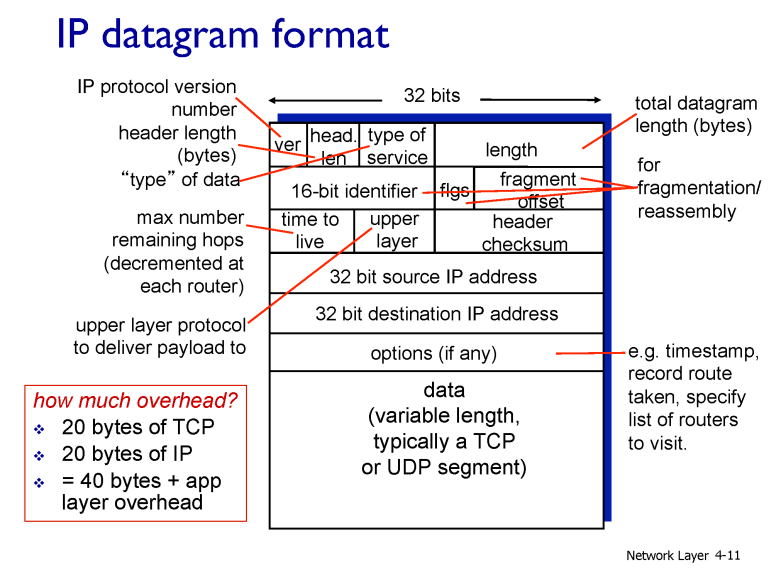
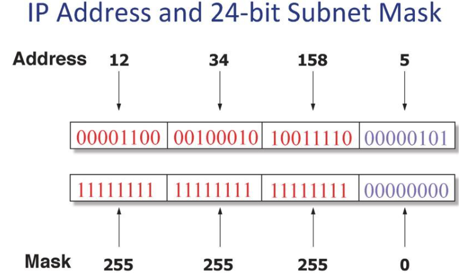
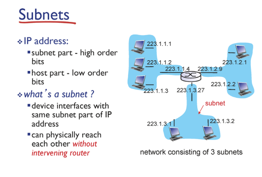
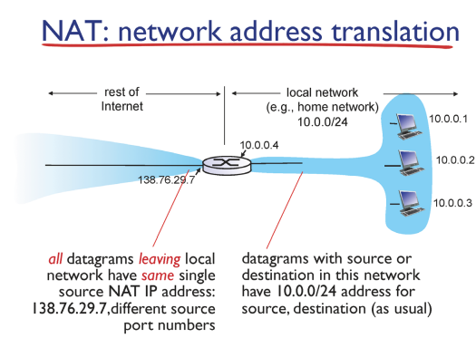

# Network

## Network layer2_d10_230416

### IP datagram format

- length-패킷의 총 길이

- ver- IP프로토콜 버전

- source IP addressm destination IP address: 메세지를 생성해서 보내는 사람의 IP주소, 받는 사람 IP 주소

- 각각의 IP헤더, TCP 헤더는 20바이트씩 나옴 , TCP/IP 프로토콜은 기본적으로 40바이트의 오버헤드 발생

- ACK 같은 경우 40바이트 씩만 가짐

### IP Address

- 네트워크 인터페이스를 지칭하는 주소

- 32비트 주소체계

- 8개씩 끊어서 10진수로 표현

- 주소를 규칙없이 배치할 경우 forwarding 테이블이 너무 복잡해짐
  
  

- 네트워크아이디와 호스트아이디로 나눔

- subnet mask: 어디까지가 네트워크 아이디 인지 호스트인지 나타냄

- 255.255.255.0- 255 3개가 네트워크 아이디, 0이 호스트 아이디

### Classless Inter-Domain Routing(CIDR)

- 8비트씩 끊어서 prefix 정하면 편차가 너무 커짐

- 자유롭게 prefix를 끊어 사용가능하게함

### Subnets

- 같은 subnet(prefix)를 가진 디바이스의 지합

- 라우터를 거치지않고 접근 가능한 호스트 집합

- 라우터는 여러개의 IP주소를 가지기 때문에 라우터는 하나의 subnet에 포함이아닌 여러 subnet에 걸쳐있음

### Network Address Translation(NAT)

- IPv4는 32비트 사용 약 40억개 ip주소 사용가능

- 보안하기위한 IPv6고안해서 출시했지만 실행x

- NAT방식을 사용해 IPv4로 연명중

- NAT 방식
  
  - 하나의 서브넷마다 사설 IP로 이용
  
  - 해당 서브넷에서 빠져나갈때 라우터가 자기IP와 포트번호로 바꿈
  
  - 서브넷은 항상 같은 IP로 옴
  
  - 해당 포트번호로 정확한 주소 찾아감
