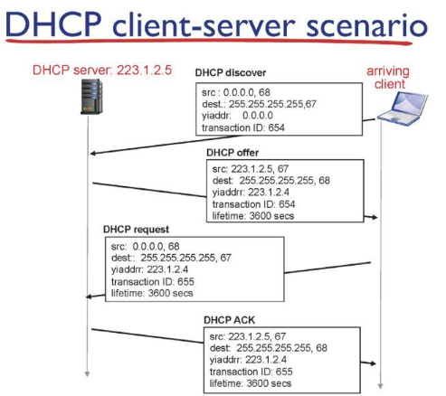

# Network

## Network layer3_d11_230422

### Dynamic Host Configuration Protocol(DHCP)

- IP, subnet mask, route, DNS  이 4가지 주소는 필수적인데 이걸 배정하는 프로토콜이 DHCP 

- 컴퓨터를 부팅할 때 동적으로 주소를 배정해줌

- 예를 들어 한 기관에서 10000개의 네트워크 사용자가 있을때 DHCP를 사용하지 않으면 IP 주소를 10000개를 다 사용해야하지만 DHCP를 통해 그때 그때 사용하는 자에게만 할당하고 회수하는 방식으로 이용됨
  
  

- DHCP discover: 새로운 client는 서버(67 port)로 IP 주소 요청

- DHCP offer: 여러 서버들이 client의 discover에 응답

- DHCP request: 여러 서버들 중 한서버와 연결, 나머지 offer를 제공한 서버들은 release함

- DHCP ACK: 연결이 되었으면 feedback전달

### IP fragmentation, reassembly

- IP packet이 생성되어 라우터를 통해 목적지까지 도달하는데 각 리으크의 최대 패킷 크기(MTU) 가 다름

- fragmentation:  packet size가 MTU 보다 큰 경우 분할해서 보냄

- ressembly: 분할된 packet을 다시 이어붙임

- fragflag: 분할되었을 때 뒤에 연결된 packet이 존재하면 1, 아니면 0

- offset: 분할된 바이트의 시작포인트 나누기 8(데이터 저장곤간 줄이기위함)
