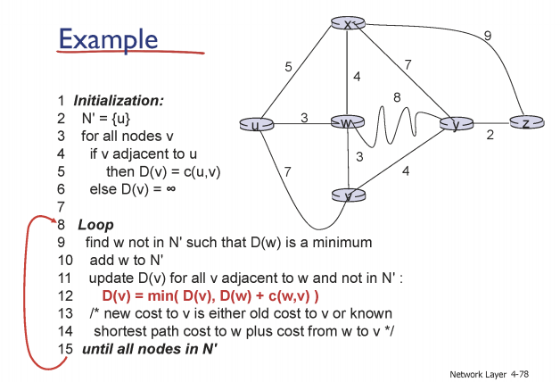
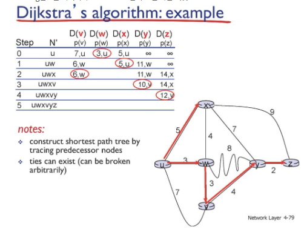

# Network

## Network layer4_d12_230423

### Routing algorithms

- 포워딩 테이블을 채우는 알고리즘

- 라이팅 알고리즘의 2종류
  
  - link state algoritm: 모든 라우터 정보를 알고 짜는  알고리즘
  
  - distance vector algorithm:  이웃된 라우터 정보만 알고 짜는 알고리즘

### Link state algorithm

- 모든 라우터의 정보를 알고 있을 경우

- Dijkstra algorithm (다익스트라, 최단경로 알고리즘)

- 각각의 라우터는 각각의 포워딩 테이블을 가짐

- 포워딩 테이블에 따라 데이터 전달할 노드 선택해서 전달
