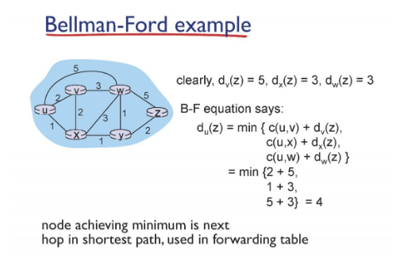
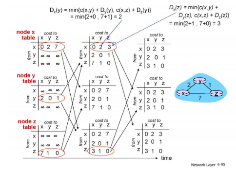

# Network

## Network layer5_d13_230429

### Distance vector algorithm

- 이웃한 라우터 정보만으로 계산

- 정보를 받을 때마다 거리를 계산해 update

- poisoned reverse :  link const가 변했을 때 최소경로가 온 길을 되돌아가는 경우 count to infinity가 발생할 수 있으므로 무한대로 업데이트해 방지

