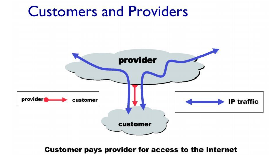
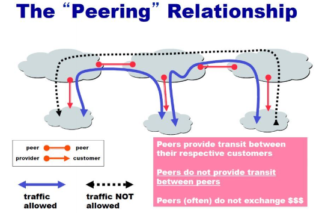

# Network

## Network layer6_d14_230430

### Autonomous systems(AS)

- 각각의 네트워크에서 어떠 ㄴ라우팅 알고리즘을 사용할지 정함

- link state algorithm, distance vector algorithm은 Intra-As

- 이것을 전체 네트워크에 적용하기에는 무리

- 큰 범위의 네트워크 끼리의 라우팅 알고리즘은 Inter-As라고함
  
  

- Inter-AS
  
  - hierarchical routing으로 구현한 프로토콜인 BGP 프로토콜 사용
  
  - AS사이에도 갑을 관계가 있음 네트워크를 제공하는 AS는 provider 제공받는 AS는 customer
  
  

- 동등한 관계에 있는 관계 : peering

- peering 관계는 자유롭게 트레픽 제공 받고 provider/customer 관계에서는 계약으로 제공받음
