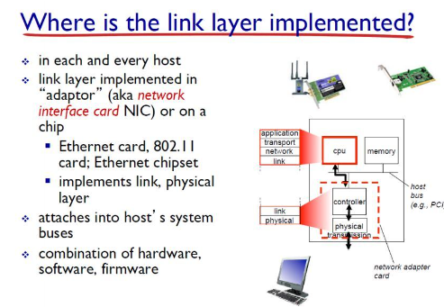

# Network

## Link_layer1_d15_230505

### Data link layer

-  하나의 게이트웨이에 여러 사용자가 패킷을 보냄

- 패킷이 물리계층을 지나며 전자파, 파장으로 변함

- 링크계층에서 패킷의 충돌 방지

- 링크계층 위에 계층들은 OS 내부에 코드로 구현되어있음

- 링크 계층은 Network Interface Card, 하드웨어에 구현되어있음

### 

### Medium Access Control(MAC protocol)

- broadcast medium
  
  - 패킷을 뿌리면 광범위한 매체에 다 전송됨
  
  - 원하는 곳에만 받을 수 있게 하는게 링크계층의 MAC protocol

- 이상적 MAC protocol
  
  - 하나의 노드가 데이터 전송을 원할경우 R에게 데이터를 보냄
  
  -  M개의 노드가 같이 사용을 원할때  R/M으로 나눠서 보냄
  
  - 이런 동작들이 컨트롤 하는 매체를 두지 않고도 분산처리해서 동작할 수 있도록한다
  
  - 단순해야함

- 이런동작이 가능하게하는 MAC protocol 3가지 분류
  
  - channel partitioning
  
  - random access
  
  - taking turns

### Channel partitioning MAC protocol

- TDMA: time division multiple access
  
  - 하나의 통로를 공유해 사용할 때 연결된 노드만큼 시간대를 나눠 하나의 노드는 해당 시간에만 전송 가능하도록 해 충돌 방지
  
  - 연결이 되어있고 전송 하지 않는 노드가 있을 경우 자원 낭비된다는 단점

- FDMA: frequency division multiple access
  
  - 각 노드마다 주파수를 나눠 해당 주파수로만 데이터 보내도록함
  
  - TDMA와 같은 단점

### Ramdom access MAC protocol

- 보내고 싶을 때 보내기

- 충돌이 발생 -> 충돌 방지하기 위한 프로토콜

- CSMA: carrier sense multiple access
  
  - listen before transmit
  
  - 전송하는 노드 있으면 전송 x , 없으면 전송o
  
  - 여러개의 노드가 동시에 듣고 같이 전송하는 경우가 있을 수 있음

- CSMA/CD(collision detection) protocol
  
  
  
  - 기존 CSMA에서 발생하는 충돌 해결하기 위해 나옴
  
  - 데이터 전송중 충돌이 발생하면 즉시 전송 멈춤
  
  - 재전송을 할때 binary backoff 사용
  
  - m번의 충돌이 있을때 {0, 1, 2, ... 2**m  - 1} 까지의 숫자중 랜덤으로 하나의 숫자를 뽑은 후 그 시간 만큼 기다림. 사용자가 몰릴 경우 속도가 느려질 수 있다는 단점

### Taking turns MAC protocol

- channel partitioning 방법은 사용자가 많으면 효율 좋지만 적으면 낭비되는 자원 발생

- random access는 사용자가 적으면 효율 좋지만 사용자가 많으면 delay 시간이 길어짐

- 총괄하는 master 하나둬 관리하는게 taking turns 프로토콜

- master가 이상이 있을경우 전체 시스템에 문제 생기기때문에 잘 사용하지 않음

