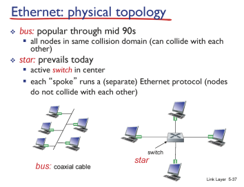
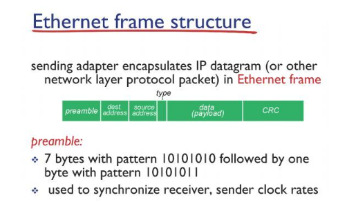
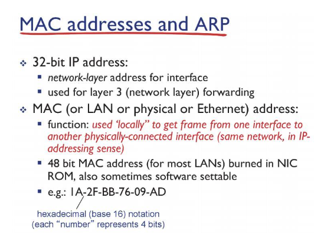
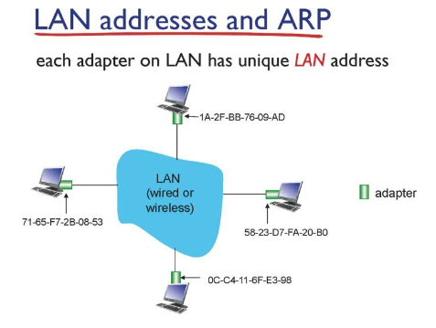

# Network

## Link_layer2_d16_230506

### Ethernet

- LAN 은 게이트웨이를 거치지 않고 접근이 가능한 네트워크 단위

- 현재의 Ethernet 은 switch를 중간에 두는 형태로 구성됨

- 프레임의 헤더에는 preamble, dest address, source address, type있음

- type에는 네트워크 프로토콜 있음

- CSMA/CD  프로토콜을 사용

- collision이 발생해도 감지 못하는 경우??
  
  - collision 방지를 위해 Ethernet 에서는 최소 64 바이트씩 데이터 전송을 강제

### MAC  address

- IP address와 MAC adress는 다름

- MAC adress 48bit으로 구성

- 앞 24bit: 제조사 번호, 뒤 24bit: 제조사의 고유번호

- 사람의 주민등록번호와 같이 불변함

### ARP

- 각 인터페이스에는 ARP table이 있음

- 테이블에는 IP 주소와 대응하는 MAC address가 적혀있다.

- 테이블에 원하는 정보가 없을 경우 ARP 테이블을 채워넣는 프로토콜이 ARP 프로토콜

- 원하는 정보가 없을 경우 ARP request라는 프레임을 LAN 전체에 브로드케스트로 보냄

- IP 주소가 상응하는 인터페이스만 응답

- ARP table에는 TTL이라는 컬럼이있어 해당정보의 유효기간 명시
