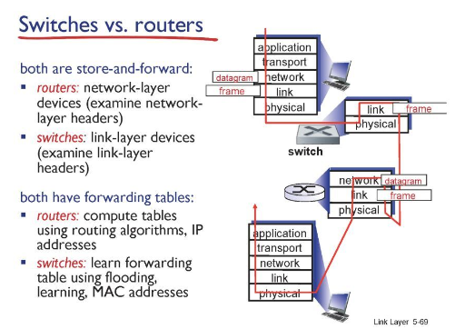

# Network

## Link_layer3_d17_230507

### Switch

- bus 형은 하나의 collision domain으로 구성, star 형은 collision domain을 분리시켜줘서 각각의 컴퓨터를 구분시켜놔 충돌이 발생하지 않게함

- switch는 연결만 도와주는 기기

- 동시에 A->A', B->B' 할 때는 충돌 x

- 동시에 A->A', B->A' 할 때 스위치가 교통정리해줌

- 스위치의 컬럼은 연결된 포트 , mac 주소, TTL

- 스위치 테이블은 self-learning 방식으로 만들어짐

- A로부터 요청이 오면 A의 포트와 mac 주소 적어둠

- 요청이 올 때 목적이 mac 주소의 포트를 알고 있으면 해당 포트로 보내고 모르면 브로드케스트

- 목적지에 맞는 인터페이스만 받고 다른 인터페이스는 버림

- 스위치 테이블에 없던 정보면 해당 정보를 저장

- 스위치는 단순 교통정리 역할, 네트워크 계층에서 고려 x

- 라우터는 어플리케이션 계층까지 있는 하나의 컴퓨터
