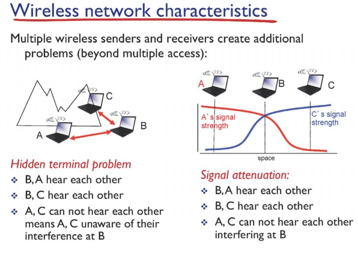
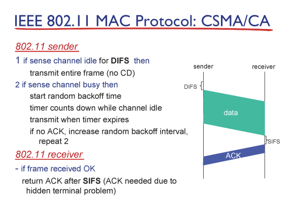
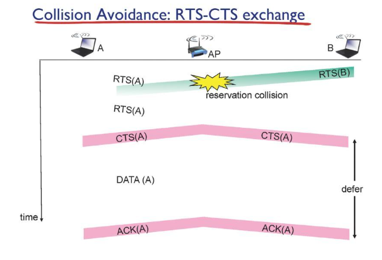

# Network

## Wireless_and_Mobile_Network_d18_230527

### Wireless_and_Mobile_Network

- wireless: 무선

- mobile: 이동가능한

- 유선은 링크라는 매체를 공유해 사용 무선은 공기라는 매체를 공유해서 사용함

- 무선일 경우 서보로 통신이 갈때 전체가 무선이 아닌 한 홉만 무선임

- 유선은 안정적인 케이블로 연결되어 있어 외보의 노이즈로부터 보호됨 그래서 연결 거리에 큰 영향 받지 않음

- 무선은 거리에 영향을 받음

### Wi-Fi(IEEE 802.11)

- 유선일 경우 모든 매체를 공유하기 때문에 충돌이 감지 됨 하지만 무선일 경우 충돌을 감지하지 못함(AP가 ACK을 보내서 충돌을 감지 - TCP의 ACK와는 다름)

- DIFS 만큼의 시간을 기다린후 다른 데이터 전송이 없으면 전송 시작

- AP는 데이터를 받고  SIFS만큼의 시간을 기다린 후 잘 받았따는 신호인 ACK를 보냄

- 센더는 데이터를 보낸 후 ACK를 받았을 때만 데이터 전송이 이루어졌따고 판단하고 다음 데이터 준비

- ACK가 오지 않으면 충돌이 발생했다 판단 -> 랜덤한 시간 후 재전송   

