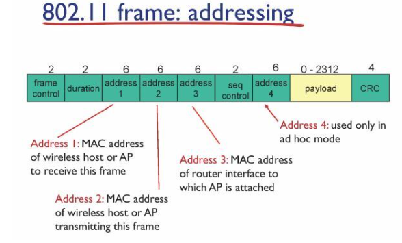
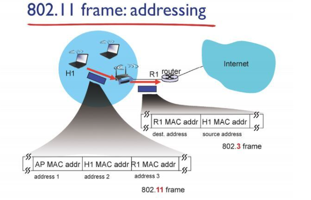
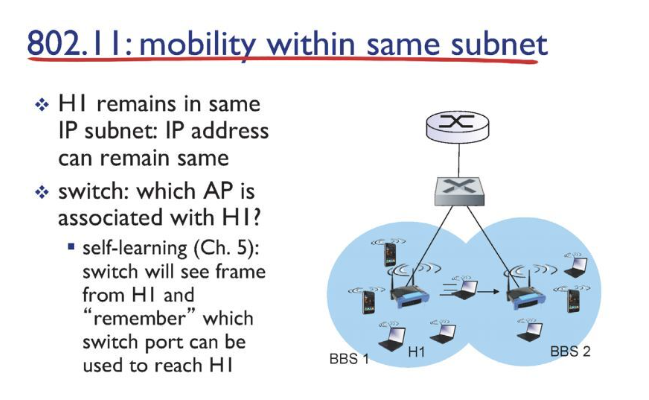

# Network

## Wireless_and_Mobile_Network_d19_230528

### IEEE 802.11 frame

- 무선 인터넷은 free한 주파수 대역 사용

- 채널을 나눠서 사용하기 떄문에 다른 채널끼리 충돌 x

- 같은 채널을 쓰는 AP끼리는 다른 AP여도 똑같이 CSMA/CA 방식으로 경쟁해서 데이터 보냄

- 무선 인터넷 프레임 헤더에 4개의 address 필드 존재
  
  - address1: 데이터를 받을 AP의 MAC 주소
  
  - address2: 데이터를 보내는 host의 MAC 주소
  
  - address3: 데이터를 받을 라우터의 MAC 주소
  
  - address4:잘 안쓰임

- AP는 한쪽의 무선, 한쪽의 유선 데이터를 받을때랑 전송할 때랑 프레임 헤더 바뀜

- AP는 host의 프레임을 받아서 자기 자신 AP 주소(address1)를 빼고 dest 주소를 라우터의 주소(address3)으로 soure 주소를 host의 주소(address2)로 설정 후 프레임을 전달함
  
  

- address3이 없을 경우 , AP는 링크 계층까지만 존재하기 때문에 해당 프레임을 열고 IP 패킷을 봐도 목적지 IP 주소로 가기위해 보내야할 다음 라우터의 MAC주소를 알 수 없음 

- address1이 없으면 AP 자체를 찾지 못함

- 무선헤더에는 주소 3개가 다있어야함

- AP가 링크 계층까지만 존재해서 주소하나를 더 추가해 라우터의 정보를 담아 주는 것

- 인터넷 사용중 이동 해서 AP가 바뀔때

- TCP 커넥션은 본인 IP 주소, port, 목적지 IP 주소, port가 바뀌지 않으면 연결이 유지됨

- 다른건 바뀔리 없고 내 IP만 안바뀌면 연결 끊기지 않음

- AP만 바꼈을 뿐 같은 서브넷 안에 있기 때문에 IP가 바뀌지 않음
