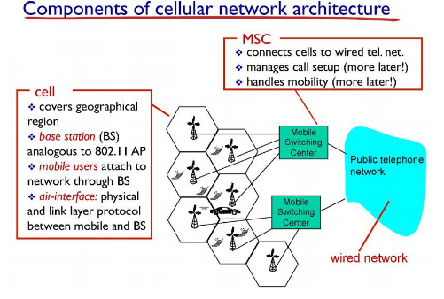
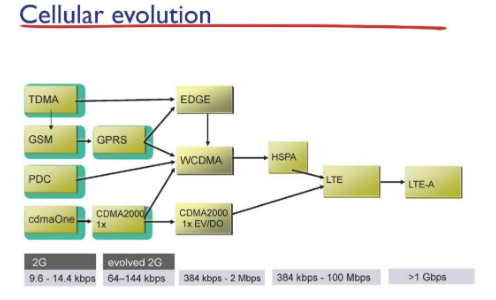
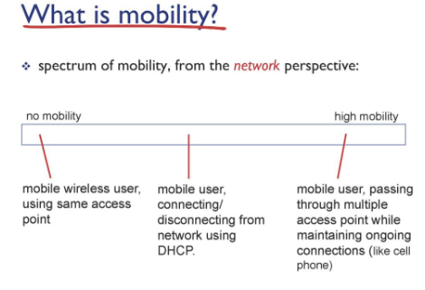
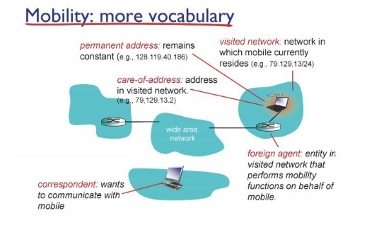

# Network

## Wireless_and_Mobile_Network_d20_230529

### Cellular Network

- 전체 담당 지역을 셀로 나눠서 셀 하나에 기지국 하나 심어놓고 그 셀에 속하는 host들을 담당해서 cellular network 라고 불림

- host와 기지국은 무선으로 연결되어 있고 기지국과 라우터는 유선으로 연결되어있음

### Mobility

- 이동중에도 네트워크게 끊기지 않게 개발된 기술, 실제 상용화 x

- 
