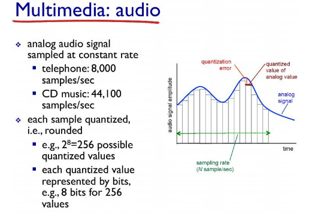
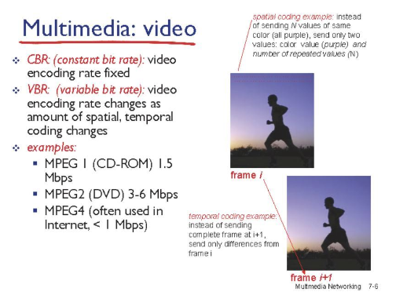
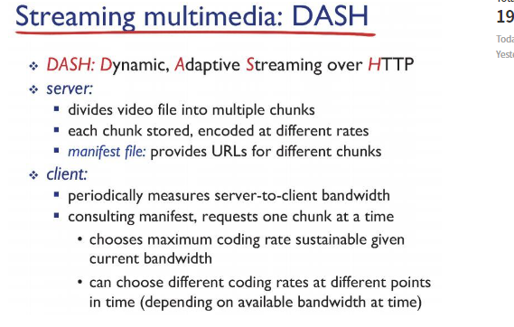

# Network

## Multimedia_networking_d21_230603

### Multimedia:audio

- 아날로그 시그널을 디지털 신호로 변화 -> sampling

- 자연스러운 소리를 정형화된 비트로 변환하는 작업

- 샘플링 주기를 짧게, 비트수가 많을수록 아날로그 소리와 같아짐

### Multimedia:video

- 비디오는 이미지의 연속, 초당 나타내는 이미지 많을 수록 고화질

- 프레임에는 해당 이미지의 모든 픽셀 정보 담김

- 초당 나타내는 프레임수 -> coding rate

### Streaming stored video

- host 는 서버에서 받은 데이터를 바로 송출하지 않고 잠시 버퍼에 담았다가 해당 버퍼가 어느정도 차면 송출 -> 버퍼링

- UDP -> 네트워크 상황을 고려 x 사용 어려움

- TCP -> 네트워크 상황에만 의존해서 컨트롤 어려움

- TCP기반의 DASH라는 프로토콜 사용
  
  

- 통째로 저장하는 것이 아닌 chunks로 쪼개서 저장

- 각 chunks별 인코딩된 url을 담아놓은 테이블 -> manifest file

- user가 영상을 시청하면 manifest file을 넘겨줌

- youtube같은 대형 플래폼의 경우 사용자가 너무 많아 요청도 많음

- 파일저장 서버를 한곳에 두는 것이 아닌 CDN 방식 사용
