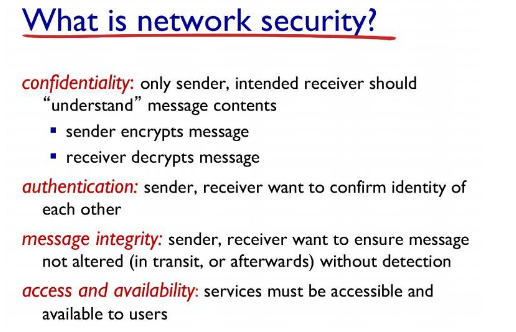
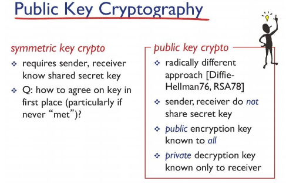
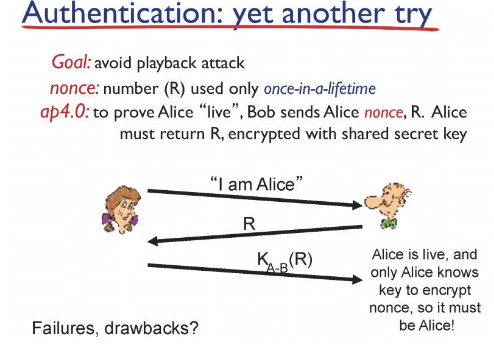

# Network

## Network_security_d22_230604

### Network security

 

- confidentiality: 기밀성, 오직 sender와 receiver 만 통신내용을 알아야함

- authentication: 인증, sender와 receiver 가 각각 상대방이라는 것을 확신할 수 있어야함

- message integrity: 메시지 변경이 일어나면 안됨

- acess and availability: 누구나 데이터 통신은 접근가능해야함

- 이러한 4가지 요소들은 OSI 계층에 포함되어 있지 않음, 설계할 때 부터 보안은 고려하지 않았기 떄문, 문제가 생길 때마다 계층에 필요한 패치를 추가하는 방식으로 보안을 구축하고 있음

- 사전 합의 없이 암호화를 하기 위해 2가지 종류의 key

- public key, private key

- 공개된 public key로 메시지를 보내면 자신만 볼 수 있는 private key로 암호를 해독

- RSA 방식, key의 순서가 상관없음 public, private 적용 순서 상관없음

### Authentication

- 발신자를 믿을 수 있는지 검증

- 엘리스가 데이터를 보내고 밥이 받으면, 확인하기 위해 R이라는 랜덤한 숫자 보냄

- 앨리스는 R을 암호화해서 밥에게 보내고 밥이 해독한후 R과 같으면 앨리스인지 확인
