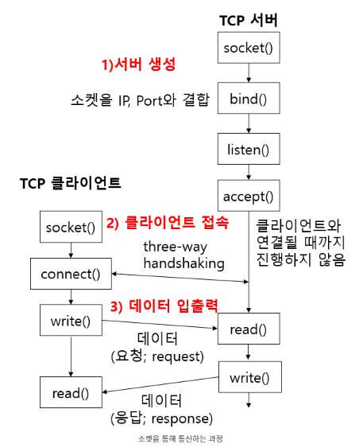
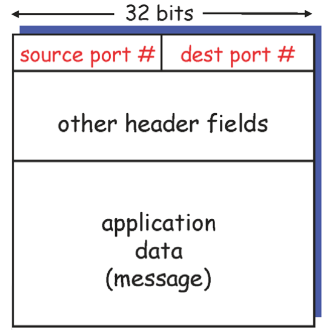

# Network

## Application layer1_d3_230312

### Socket

- 컴퓨터 네트워크를 경유하는 프로세스 간 통신의 종착점

- OS에서 제공하는 API 일종

- 두개의 타입
  
  - TCP 프로토콜을 사용하는 경우
  
  - UDP 프로토콜을 사용하는 경우

### Socket을 통한 통신과정

\

- 서버 생성
  
  - socket()
    
    - socket을 생성하며 타입을 정함(TCP or UDP)
    
    - socket 생성 실패시 -1 반환
  
  - bind()
    
    - 서버가 패킷을 전달받기 위해서 주소가 필요, 이역할을 IP 주소와 포트 번호가 대신해줌
  
  - listen()
    
    - 연결 요청을 대기하는 것
  
  - accept()
    
    - 연결 요청을 수락
    
    - 새로 연결 요청이 들어오면 accept() 함수가 클라이언트를 서버에 연결
    
    - 연결 요청이 들어올 떄까지 대기

- 클라이언트 접속
  
  - 서버와 거의 동일
  
  - IP 주소, 포트 번호가 고정될 필요 없음 => bind() 필요없음

### Multiplexing

- Transport layer 에서 다중화(Multiplexing)란 application 계층의 여러 소켓에서 전송되는 데이터를 하나로 모으는 것. 모아진 데이터를 세그먼트(segment)라 한다.

### Demultiplexing

- 전송받은 segment의 데이터를 적절한 소켓에 전달 해주는 것

- segment의 헤더에 적힌 정보를 통해 알맞은 포트로 올려줌

### Segment

- 세그먼트는 transport layer에서 다중화하여 만들어진 데이터

- 데이터 와 헤더로 구성
  
  - 헤더:  source port number, dest port number 들어있음
  
  - 데이터: message가 들어있음

- 포트 번호 
  
  - 역다중화(ddemultplexing)하여 데이터를 적절한 소켓에 전달
  
  - 적절한 소켓을 고르기 위해 포트 번호로 구분
