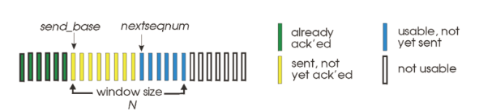

# Network

## Transport layer1_d5_230326

### Pipelined protocol

- 기존의 RDT 3.0은 하나의 패킷이 도착하고 ACK이 돌아올 때까지 메시지를 보낼 수 없음

- 네트워크 활용률이 떨어짐

- 신뢰성있는 파이프라인 포로토콜 구축하기 위한 방법 두가지
  
  - GO-Back-N
  
  - Selective repeat

### Go-Back-N

- window size:  한번에 보낼 수 있는 패킷의 양

- 누적 방식으로 패킷을 재전송

- timeout 시 윈도우 내 모든 패킷을 재전송

- timeout 발생시 window size가 N일 때 N만큼 다시 되돌아오게 됨

- N이 커진다면 정상적으로 전송된 패킷이 버려지고 재전송되는 양이 늘어남

- 이를 개선하는 방법이 Selective Repeat

### Selective  Repeat

- 패킷이 유실되어 재전송할 떄 패킷을 선별적 재전송

- 패킷을 받을 때 마다 각각 ACK 전송

- 패킷이 순서대로 정렬되어 있어야 하므로 다음 순서의 패킷을 임시로 저장할 필요

- 시퀀스 번호가 무한하지 않다는 문제

- 적정값은 window size가 N 이라면 시퀀스번호는 N*2정도가 적정
