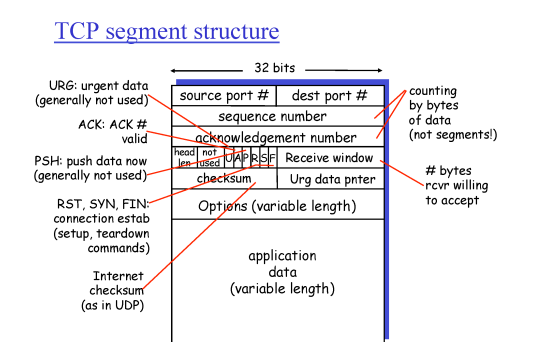
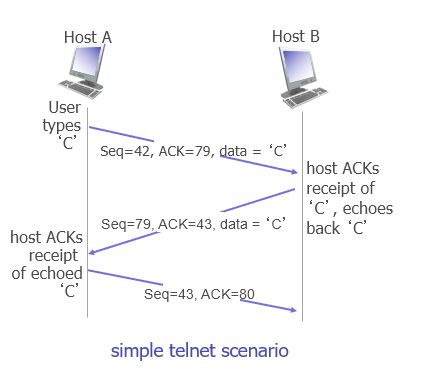
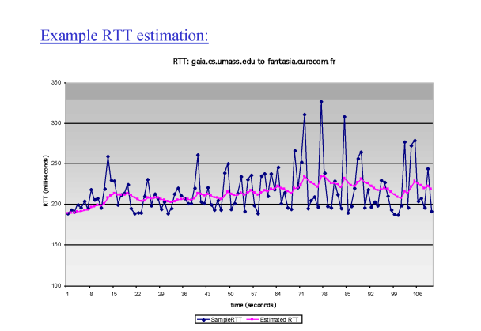
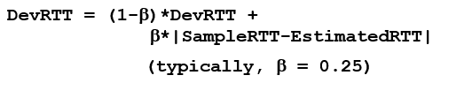

# Network

## Transport layer2_d6_230402

### TCP 특징

- point to point : 1대1 대응 방식으로 연결이 맺어지면 그곳이랑만 통신

- reliable, in- dorder byte steam: aplication maessage가 유실없이 순서를 유지한 채로 보내지는 것

- pipelined: 메시지를 한 번에 많이 보낼 수 있는 거

- full duplex data: sender와 receiver가 고정된 것이 아닌 sender이자 receiver인것

- connection-oriented: 초기에 handshake를 통해 연결을 맺는 것

- flow controlled: 리시버가 받을 수 있을 만큼만 데이터를 보냄

- condition control: 네트워크가 꽉 막힌 상태에서 보내게 되면 상태만 악화됨

### TCP 세그먼트 구조

- sequence number: 받는 쪽에서 새로운 데이턴지 중복 데이터인지 구분하기 위해 트래킹 가능하도록 설정하느 값

- acknowledgement number:  잘받았다는 의미로 보내느 ACk

-  akcnoowledfgements
  
  - ACK # 100이 응답으로 왔다면?
    
    - 99번까지는 문제 없고 100번을 기다리고 있다는 뜻. cumulateive ACK이라고도한다.
  
  - 
  
  - A가 Seq= 42를 통해 42번 데이터를 전송 ACK = 79를 통해 78번까지 잘받고 79번 데이터를 기다린다는 메시지를 B에게 전달 , B는 42번 데이터를 잘 받았다는 뜻으로 ACK = 43을 주고 A가 요청한 79번 데이터를 seq = 79 를 통해 전송

### RTT

- TCP 타이머 값에 대한 세팅값

- smapleRTT
  
  세그먼트가 나갈 떄부터 피드백 올때까지의 시간을 측정한것
  
  - sample RTT는 매번 다르게 나옴 -> 네트워크 환경이 바뀌고, 각 세그먼트가 겪는 큐잉 딜레이가 다르기 떄문 -> estimatedRTT

- estimatedRTT
  
  
  
  - 가중치를 두어서 측정, 가장 최근에 측정된 sampleRTT에 가중치를 매겨 측정하는 법

- timeout interval
  
  - EstimatedRTT 값에 margin 을 더한 것
  
  - 
