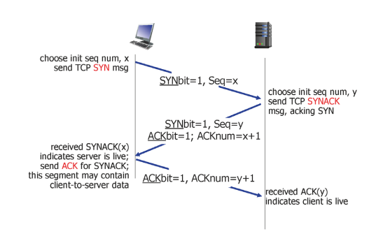
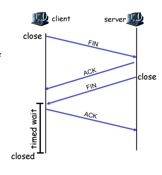

# Network

## Transport laye3_d8_230408

### TCP flow contrtol

- TCP 는 파이프라인 방식으로 한꺼번에 많은 데이터 보냄

- sender가 receiver가 받을 수 있는 속도만큼 보내주는 것이 flow control

- receiver가 sender에게 보내는 세그먼터 헤더중 Receive window라는 칸에 남은 버퍼의 사이즈를 담아서 전달

- sender는 세그먼트 헤더를 받은 후 receiver의 남은 버퍼 사이즈만큼만 데이터를 보냄

- Receive 버퍼가 가득 차면 sender는 계속해서 아무것도 보내지 않는 상황이 발생할 수 있기에 아주 작은 데이터를 계속 보내고 receive 버퍼의 동향을 살핌

### TCP 3-way handshake

- SYN 비트에 1을 담아 보내 연결을 맺음

- 3번째는 client에서 segment도 함께 보냄

- colsing TCP connection

- timed wait 가 있는 이유
  
  - ack을 받지 못할 경우 server에서 계속 ack을 기다리게 되기 때문
