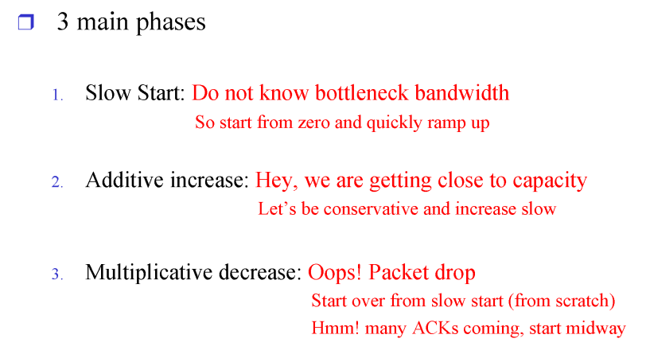
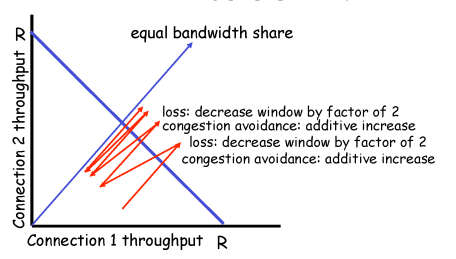

# Network

## Transport laye3_d8_230408

### TCP congetion contrtol

- sender가  데이터를 보낼때 참고해야하는 것
  
  - 네트워크가 받아드릴 수 있는 양
  
  - 리시버가 받아드릴 수 있는 양
  
  - 둘 중 크기가 작은 양에 맞춰 보내야함
  
  - flow control을 통해 리시버가 받아드릴 수 있는 양을 정확히 알 수 있음
  
  - 하지만 네트워크는 무형이라 불가
  
  - 해결법 congetion control

- tcp 경우 네트워크 상황을 고려하지 않고 계속 전송시 악화
  
  - 네트워크 상황에 맞게 전송하는 양을 줄여야함

- congetion control 방법 2가지
  
  - Network-assisted congetion control: 네트워크가 직접 네트워크 상황 알려줌
    
    - 라우터는 기능x -> 구현이 불가능
  
  - End-end congetion control : 양끝의 엣지(서버와 클라이언트)가 알아서 네트워크 상황을 유추해 속도 조절

- 네트워크 상황 유추, 속도 조절에 사용 되는 3main phases
  
  
  
  - slow start : 처음에는 네트워크 상홍을 모르기 때문에 아주 조금씩 보냄, 하지만 증가폭은 크게
  
  - additive increase: 일정 부분을 지나면 증가폭을 줄임, 처음에는 아주 작게 시작해 증가폭을 크게 하지만 일정 부분을 지나고나서는 증가폭을 작게함
  
  - multiplicative decrease: 증가폭을 늘리다가 데이터 유실이 발생하면 데이터 전송량을 반으로 줄임 다시 slow start부터 시작
  
  - MSS(Maximum Segment Size) : 전송하는 세그먼트 크기 , 500Byte

### 

### TCP fairness

- 먼저 쓰면 처음에는 더 높은 속도 

- 후발 주자가 생기면 loss가 발생해 속도를 반으로 줄임

- 결국 공평해진다.

