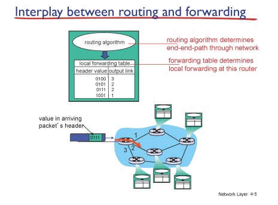

# Network

## Network layer1_d9_230415

### Interplay between routing adn forwarding

- forwarding 
  
  - 들어온 패킷의 목적지 주소와 forwarding 테이블의 엔트리를 매칭시켜서 그 엔트리에 해당하는 링크로 전달

- routing
  
  - forwarding 테이블을 만들어 주는 역할담당
  
  - 라우터는 오직 들어온 패킷을 라우팅 알고리즘에 따라 다음 라우터로 전달하는 역할만함
  
  - 라우터에 모든 도착지 정보를 담아둘수 없음, 대략적인 큰 범위만 구분
  
  - 
