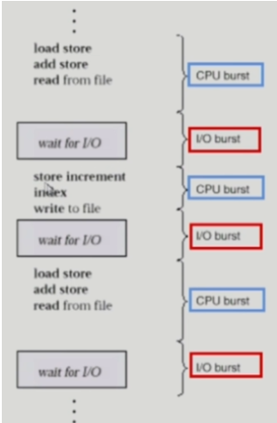
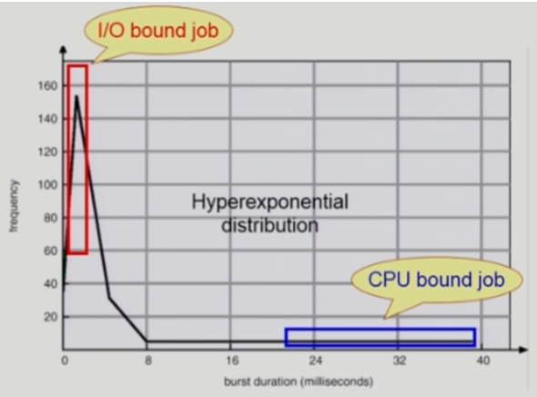
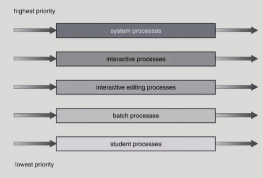
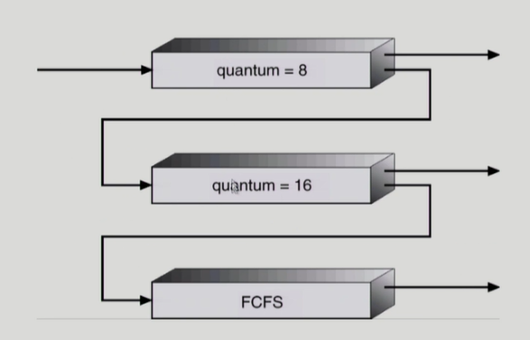

# CS 스터디 - day05_230201

## 운영체제(Operating systems, OS)

### CPU Scheduling

1. CPU and I/O Bursts in Program Execution
   
   
   
   - 프로그램은 CPU를 연속적으로 쓰는 단계와 I/O를 하는 단계가 번갈아가면서 실행됨
   
   - CPU burst : CPU만 연속적으로 쓰는 단계
   
   - I/O burst: I/O를 실행하고 있는 단계
   
   - 주로 사람이 interaction하는 프로그램이 중간에 I/O burst가 자주끼어듬, 프로그램의 종류에 따라 빈도나 길이가 다름

2. CPU burst Time의 분포
   
   
   
   - CPU burst가 짧고 중간에 I/O 가 많이 끼어드는 job은 빈도가 높음
   
   - CPU burst가 아주 긴 job은 빈도가 낮음
   
   - 프로세스 특성 분류
     
     - I/O bound process
       
       - 주로 사람하고 interactive 하는 job
       
       - CPU를 잡고 계산하는 시간보다 I/O에 많은 시간이 필요
       
       - masy short CPU bursts.
     
     - CPU bound process
       
       - 계산 위주의 job
       
       - 주로 computing bound job
       
       - few very long CPU bursts.

3. CPU Scheduler & Dispatcher
   
   - CPU Scheduler
     
     - 운영체제 안에서 스케줄링하는 코드가 있음
     
     - Ready 상태의 프로세스 중에서 이번에 CPU를 줄 프로세스를 고름
   
   - Dispatcher
     
     - CPU를 누구에게 줄 지 결정한 뒤 해당 프로세스에 CPU를 넘겨주는 역할을 하는 운영체제 커널 코드 -> CPU의 제어권을 CPU scheduler에 의해 선택된 프로세스에게 넘김
     
     - 이과정을 context switch(문맥 교환)라고 함
   
   - CPU 스케줄링이 필요한 경우는 프로세스에게 다음과 같은 상태 변화가 있는 경우
     
     - Running -> Blocked (예: I/O 요청하는 시스템 콜) => 자진해서 CPU를 내어놓음
     
     - Running -> Ready (예: 할당시간만료로 timer interrupt)
     
     - Blocked -> Ready (예: I/O 완료 후 인터럽트)
     
     - Terminate (종료)
     
     - 1,4 => nonpreemptive(강제x 자진 반납)
     
     - 2,3 => preemptive(강제로 뻇음)

4. Scheduling Criteria ( 성능 척도)
   
   - 시스템 입장 성능 척도-CPU하나로 최대한 일을 많이 시키면 좋은 것
     
     - CPU itilization(이용률): 전체 시간중 CPU가 놀지 않고 일한 비율
     
     - Throughput(처리량): 주어진 시간 동안 몇개의 작업을 완료했는지
   
   - 프로그램 입장 성능척도- CPu를 빨리 얻어서 빨리 끝나면 좋은 것
     
     - turnaround time(소요시간, 반환시간): CPU를 쓰러 들어와서 다쓰고 나갈 떄까지 걸린시간-> 기다린 시간 + 쓴시간
     
     - waiting time(대기시간): CPU를 쓰기위해 기다린 시간
     
     - respose time(응답 시간): ready 에서 처음으로 CPU를 얻기 까지 걸린 시간

5. FCFS
   
   - 먼저 온 순서대로 처리
   
   - 비선점형 스케줄링
   
   - 앞에 어떤 프로세스가 버티냐에 따라 기다리는 시간에 큰 영향을 끼친다.
   
   - convoy effect: 긴 프로세스가 도착해서 짧은 프로세스들이 오래 기다려야 하는 현상

6. SJF(Shortest-Job-First)
   
   - CPU burst가 제일 짧은 프로그램한테 CPU를 주는 스케줄
   
   - 두가지 방식
     
     - Nonpreemptive
       
       - 일단 CPU를 잡으면  이번 CPU burst가 완료될 떄까지 CPU를 뻇기지 않음
     
     - Preemptive
       
       - CPU를 줬다 하더라도 더 짧은 프로세스가 도착하면 CPU 뻇어서 그 프로세스한테 넘겨줌
   
   - SJF 문제점
     
     - CPU 사용시간이 긴 프로세스는 실행되지 않을 수 있음 -> Starvation
     
     - CPU 사용시간을 미리 알 수 없음

7. Priority Scheduling
   
   - 우선순위가 제일 높은 프로세스에게 CPU를 줌
   
   - 두가지방식
     
     - preemptive
     
     - nonpreemptive
   
   - 각 프로세스마다 우선순위를 나타내는 숫자가 주어짐 (작을 수록 우선순위 높음)
   
   - SJF도 일종의 Priority Scheduling이다.
   
   - SJF와 같은 문제점 -> 우선순위가 낮은 프로세스는 CPU 얻지 못할수있다. starvation
   
   - 해결법 -Aging 사용
     
     - 우선순위가 낮아도 오래 기다리면 우선순위를 높여줌

8. Round Robin(RR)
   
   - 각 프로세스는 동일한 크기의 할당시간을 가짐
   
   - 할당시간을 세팅해서 준뒤 시간이 끝나서 timer interrupt가 걸리면 CPU를 뺴앗기고 Ready queue 제일 뒤에 가서 줄을 서는 것
   
   - 현대적인 컴퓨터 시스템에서 사용하는 CPU 스케줄링은 RR에 기반
   
   - 응답 시간이 빠른것이 장점
   
   - 일반적으로 SJF보다 average turnaround time이 길지만 response time은 더 짧음

9. Multilevel Queue
   
   
   
   - Ready que를 여러 개로 분할
     
     - foreground(initeractive)
     
     - background(batch -> no human interaction)
   
   - 각 큐는 독립적인 스케줄링 알고리즘을 가짐
     
     - foreground - RR
     
     - background - FCFS
   
   - 큐에 대한 스케줄링이 필요
     
     - fixed priority scheduling: 우선순위를 강하게 적용하는 방식, starvation 발생
     
     - Time slice: 각 큐에 CPU time을 적절한 비율로 할당

10. Mutilevel Feedback Queue
    
    
    
    - 여러 줄로 줄서기를 하지만 프로세스가 경우에 따라 다른 큐로 이동할 수 있는 스케줄링
    
    - Aging을 이와 같은 방식으로 구현할 수 있음
    
    - Multilevel Feedback Queue Scheduler를 정의하는 파라미터들
      
      - 큐의 수
      
      - 각 큐의 scheduling algorithm
      
      - 프로세스를 상위 큐로 보내는 기준
      
      - 프로세스를 하위 큐로 내쫓는 기준
      
      - 프로세스가 CPU 서비스를 받으려 할 때 들어갈 큐를 결정하는 기준

11. Multiple-Processor Scheduling
    
    - CPU가 여러 개인 경우 스케줄링은 더욱 복잡해짐
    
    - Homogeneous processor인 경우
      
      - 큐에 한줄로 세워서 각 프로세서가 알아서 꺼내게 할 수있다.
      
      - 반드시 특정 프로세서에서 수행되어야 하는 프로세스가 있는 경우에는 문제가 더 복잡해짐
    
    - Load sharing
      
      - 일부 프로세서에 job이 몰리지 않도록 부하를 적절히 공유하는 메커니즘 필요
      
      - 별개의 큐를 두는 방법 vs 공동 큐를 사용하는 방법
    
    - Symmetrice Multiprocessing(SMP)
      
      - 각 프로세서가 각자 알아서 스케줄링 결정
    
    - Asymmetric multiprocessing
      
      - 하나의 프로세서가 시스템 데이터의 접근과 공유를 책임지고 나머지 프로세서는 거기에 따름

12. Real Time Scheduling
    
    - Hard real-time systems
      
      - Hard real-time task는 정해진 시간 안에 반드시 끝내도록 스케줄링해야 함
    
    - Soft real time computing
      
      -  Soft real-time task는 일반 프로세스에 비해 높은 priority를 갖도록 해야 함

13. Thread Scheduling
    
    - Local Scheduiling
      
      - User level thread의 경우 사용자 수준의 thread library에 의해 어떤 thread를 스케줄 할 지 결정
    
    - Global Scheduling
      
      - kernel level thread의 경우 일반 프로세스와 마찬가지로 커널의 단기 스케줄러가 어떤 thread를 스케줄 할지 결정

14. Algorithm Evaluation
    
    - Queueing models
      
      - 확률 분포로  주어지는 arrival rate와 service rate 등을 통해 각종 performance index 값을 계산
    
    - implementation (구현) & Measurement (성능 측정)
      
      - 실제 시스템에 알고리즘을 구현하여 실제 작업(workload)에 대해서 성능을 측정 비교
    
    - Simulation(모의실험)
      
      - 알고리즘을 모의 프로그램으로 작성 후 trace를 입력으로 하여 결과 비교

            
