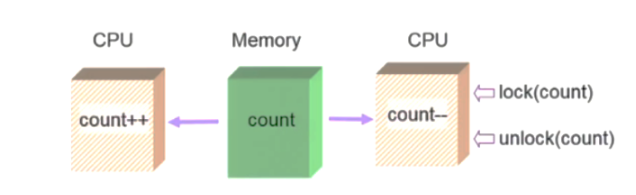
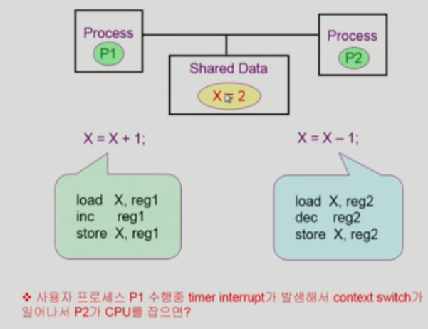
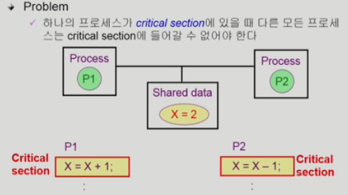
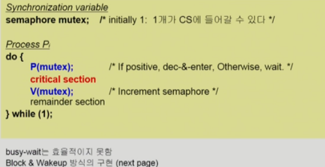
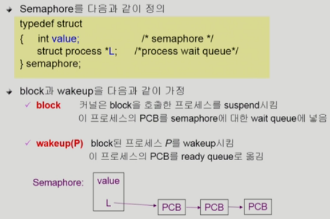
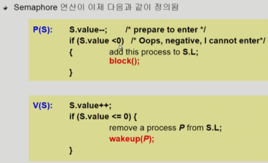
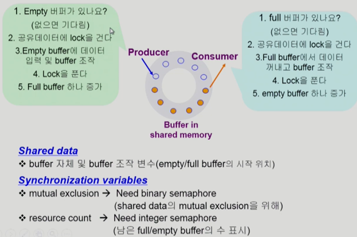
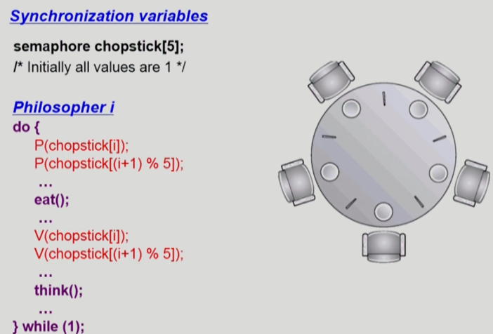
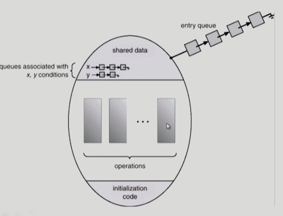
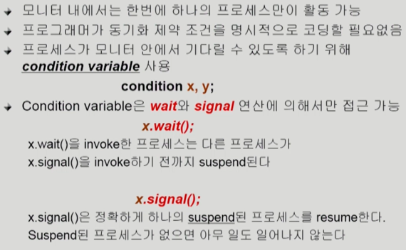

# CS 스터디 - day06_230202

## 운영체제(Operating systems, OS)

### Process Synchronization

1. Race condition
   
   
   
   - 하나의 공유 data에 여럿이 접근하려고 할 때, 즉 연산할 수 있는 주체가 여러 개일 떄 발생하는 문제
   
   - S-box를 공유하는 E-box가 여럿 있는 경우 , race condition의 가능성이 있음

2. OS에서 race condition 발생 하는 경우
   
   - kernel 수행 중 인터럽트 발생 시
     
     - 
     
     - 커널 모드에서 수행중 더 급하고 중요한 인터럽트가 발생해 인터럽트 처리 루틴이 수행하도록 CPU를 넘길 떄
     
     - 양쪽다 커널 코드이므로 kernal address space를 공유한다
     
     - 해결법 : count 변수를 건드리기전에 interrupt disable 시켜둠.
   
   - 프로세스가 시스템 콜을 하여 커널 모드로 수행 중인데 context switch가 일어나는 경우
     
     - 
     
     - 두 프로세스의 address space 간에는 data sharing이 없음
     
     - 그러나 시스템콜을 하는동안에는 kernel address space의 data를 access하게 됨
     
     - 이 작업 중간에 CPU를 preempt 해가면 race condition 발생
     
     - 해결책: 커널 모드에서 수행 중일 때는 CPU를 preempt하지 않음, 커널 모드에서 사용자 모드로 돌아갈 떄 preempt
   
   - Multiprocessor에서 shared memory 내의 kernel data
     
     
     
     - 해결 법 1 : 한번에 하나의 CPU만이 커널에 들어갈 수 있게 하는 법
     
     - 해결 법 2: 커널 내부에 있는 각 공유 데이터에 접근할 때마다 그데이터에 대한 lock / unlock을 하는 방법

3. Process Synchronization 문제 
   
   
   
   - 공유 데이터(shared data)의 동시 접근(concurrent access)은 데이터의 불일치(inconsistency) 문제를 발생시킬 수 있다.
   
   - 일관성(consistency) 유지를 위해서는 협력 프로세스간의 실행 순서(orderly execution)를 정의해주는 메커니즘이 필요함
   
   - Race condition을 막기 위해서는 concurrent process는 동기화(synchronize)되어야 함

4. The Critical-Section Problem
   
   - n 개의 프로세스가 공유 데이터를 동시에 사용하기를 원하는 경우
   
   - critical section: 공유 데이터를 접근하는 코드

5. Initial Attempts to solve problem
   
   - MUtual Exclusion(상호 배제)
     
     - 프로세스 Pi가 critical section 부분을 수행 중이면 다른 모든 프로세스들은 그들의 critical section에 들어가면 안 된다.
   
   - Progress(진행)
     
     - critical section에 아무도 없으면 들어가게 해줘야한다
   
   - Bounded waitiong(유한 대기)
     
     - 프로세스가 critical section에 들어가려고 요청한 후부터 그 요청이 허용될 때까지 다른 프로세스들이 critical section에 들어가는 횟수에 한계가 있어야 한다. 

6. Semaphores
   
   - semaphore가 가지는 정수의 의미는 자원의 개수, 변수값을 1로 초기화하면 lock을 걸고(0) lock을 풀고(1)하는데 사용할 수있음
   
   - atomic 연산에 의해서만 접근 가능
   
   - P연산
     
     - 공유데이터를 획득하는 과정
     
     - 누간가 자원을 내놓으면 그걸 획득함
     
     - 자원이 없으면 while문을 돌면서 기다림
   
   - V연산
     
     - 공유데이터를 다 사용하고 반납하는 과정

7. Critical Section of n processes
   
   
   
   - busy-wait(=spin lock) -> 비효율적
   
   - Block &Wakeup(=sleep lock) => 효율적

8. Block/Wakeup implementation
   
   
   
   
   
   - 프로세스를 blcok상태로 바꿔주고 나중에 V연산에서 자원을 반납할 때 block된 프로세스 중에 하나를 꺠우는 형태(block and wakeup)
   
   - S.value가 음수면 자원을 기다리는 의미
   
   - S.value가 양수면 쓰고있는 중이라는 의미
   
   - 일반 적으로는 Block/wakeup 방식이 더 좋음

9. Two Types of Semaphores
   
   - Counting semaphore
     
     - 도메인이 0 이상인 임의의 정수값
     
     - 주로 resource counting에 사용
   
   - Binary semaphore
     
     - 0 또는 1값만 가질 수 있는 semaphore
     
     - 주로 mutual exclusion(lock/unlock)에 사용

10. Deadlock and Starvation
    
    - Deadlock
      
      - 둘 이상의 프로세스가 서로 상대방에 의해 충족될 수 있는 event를 무한히 기다리는 현상
    
    - Starvation
      
      - indefinite blocking. 프로세스가 suspend된 이유에 해당하는 세마포어 큐에서 빠져나갈 수 없는 현상

11.  Classical Problems of Synchronization
    
    - Bounded-Bouffer Problem(Producer-Consumer Problem)
      
      
      
      - 두개의 프로세스, producer, consumer 프로세스가 여러개 있음
      
      - 주황색 부분은 Full, 회색 부분은 Empty, Empty buffer은 원래 비어있던것 혹은 생산자가 만들어놓은걸 consumer가 사용한 것
      
      - Semaphore를 이용해 두개 이상의 공유데이터에 접근하는 것을 막고 가용자원이 가득차거나 비었을 때 생산자와 소비자에게 알려주기 위해 Counting Semaphore가 필요
    
    - Readers and Witers Problem
      
      - 한 process가 DB에 write 중일 떄는 다른 process가 접근하면 안됨
      
      - read는 동시에 여럿이 해도 됨
      
      - solution
        
        - Writer가 DB에 접근 허가를 아직 얻지 못한 상태에서는 모든 대기중인 Reader들을 다 DB에 접근하게 해준다
        
        - Writer는 대기 중인 Reader가 하나도 없을 때 DB 접근이 허용된다
        
        - 일단 Writer가 DB에 접근 중이면 Reader들은 접근이 금지된다
        
        - Writer가 DB에서 빠져나가야만 Reader의 접근이 허용된다
    
    - Dining-Phoilosophers Problem
      
      
      
      - 앞의 solution의 문제점
        
        - Deadlock 가능성이 있음
        
        - 모든 철학자가 동시에 배가 고파져 왼쪽 젓가락을 집어버린 경우
      
      - 해결 방안
        
        - 4명의 철학자만이 테이블에 동시에 앉을 수 있도록 함
        
        - 젓가락을 두개 모두 집을 수 있을 때만 젓가락을 집을 수 있게 함
        
        - 비대칭
          
          - 짝수(홀수)철학자는 왼쪽(오른쪽) 젓가락부터 집도록 

12. Monitor
    
    - Semaphore의 문제점
      
      - 코딩하기 힘듬
      
      - 정확성(correctness)의 입증이 어려움
      
      - 자발적 협력(voluntary cooperation)이 필요
      
      - 한번의 실수가 모든 시스템에 치명적 영향
    
    - 모니터는 프로그래밍 언어차원에서 제공
      
      
    
    - 공유데이터에 접근하려면 monitor에 정의된 operation을 통해서만 접근 가능
    
    - monitor는 기본적으로 동시 접근을 허용하지 않고, 모니터가 알아서 하나의 프로세스만 접근 가능하게 하고 나머지는 줄을 세움 -> 락을 걸 필요없음
    
    - 
    
    - 조건이 충족되지 않으면 잠들게 할 수 있음 wait 명령어를 통해. signal 명령어를 이용해 다시 깨울 수 있음
