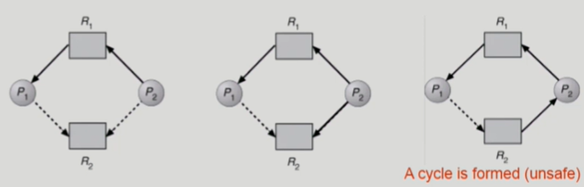
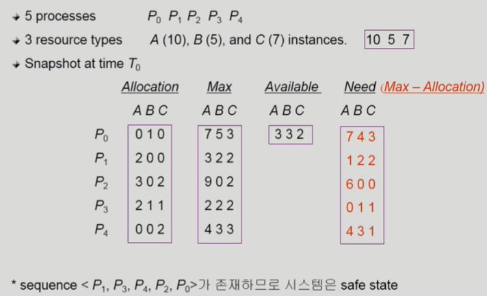

# CS 스터디 - day07_230207

## 운영체제(Operating systems, OS)

### Deadlocks

: 일련의 프로세스들이 서로가 가진 자원을 기다리며 block된 상태

1.  Deadlock 발생의 4가지 조건
   
   밑의 4가지 조건 중 하나라도 만족하지 않으면 deadlock 발생하지 않음
   
   - Mutual exclusion(상호 배제)
     
     - 매 순간 하나의 프로세스만이 자원을 사용할 수 있음
     
     - 독점적 사용
   
   - No preemption(비선점)
     
     - 프로세스는 자원을 스스로 내어놓을 뿐 강제로 뺴앗기지 않음
   
   - Hold and wait(보유 대기)
     
     - 자원을 가진 프로세스가 다른 자원을 기다릴 때, 보유 자원을 놓지 않고 계속 갖고있음
   
   - Circular wait(순환 대기)
     
     - 자원을 기다리는 프로세스간 사이클이 형성되어야함

2.  Deadlock의 처리 방법
   
   - Deadlock이 생기지 않도록 방지하는 방법
     
     - Deadlock prevention 
       
       자원 할당시 Deadlock의 4가지 필요 조건 중 어느 하나가 만족되지 않도록 하는 법
       
       - Mutual Exclusion
         - 막을 수 있는 조건 X
       - Hold and Wait
         - 방법 1 : 프로세스 시작 시 모든 필요한 자원을 할당받게 하는 것
           - 자원의 비효율성
         - 방법 2 : 자원이 필요한 경우 보유 자원을 모두 놓고 다시 요청
       - No Preemption
         - 모든 필요한 자원을 얻을 수 있을 때
         - state를 쉽게 save하고 restore 할 수 있는 자원에서 주로 사용 (CPU, memory)
       - Circular Wait
         - 모든 자원 유형에 할당 순서를 정하여 정해진 순서대로만 자원 할당
       - deadlock을 막을 수는 있지만 자원에 대한 이용률 (utilization)은 떨어지고, throughput 감소 및 starvation 문제
     
     - Deadlock Avoidance
       
       - 자원 요청에 대한 부가적인 정보를 이용해서 deadlock의 가능성이 없는 경우에만 자원을 할당
       
       - 시스템 state가 원래 state로 돌아올 수 있는 경우에만 자원 할당
       
       - Single instance per resource types
         
         - Resource Allocation Graph Algorithm 사용
         
         - 
       
       - Multiple instaces per resource types
         
         - Banke's Algorithm
           
           - 각 프로세스의 최대 요청 자원 수를 충족하는 시퀀스가 존재하므로 safe state (deadlock 생기지 않음)
           
           - 하지만 자원이 남아 돌아도 최대 요청이 가용 자원 수보다 적으면 주지 않기 때문에 비효율적임
           
           - 
       
       
   
   - Deadklock이 생기도록 일단 놔두는 방법
     
     - Deadlock Detection and recovery
       
       - Deadlock 발생은 허용하되 그에 대한 detection 루틴을 두어 deadlock 발견시 recover
       
       - recovery
         
         - process termination
           
           - deadlock에 연루된 프로세스들을 모두 죽임
           
           - deadlock에 연루된 프로세스들을 하나씩 죽임(deadlock이 없어질 때까지)
         
         - resource preemption
           
           - deadlock에 연루된 프로세스들로부터 자원을 뻇는 방법
           
           - safe state로 rollback하여 process를 restart
           
           - starvation 문제
     
     - Deadlock Ignorance
       
       - Deadlock을 시스템이 책임지지 않음
       
       - UNIX를 포함한 대부분의 OS가 채택

