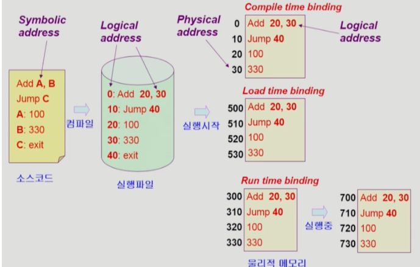
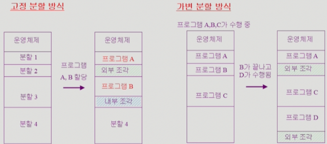
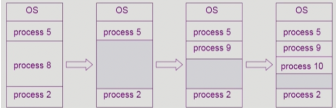
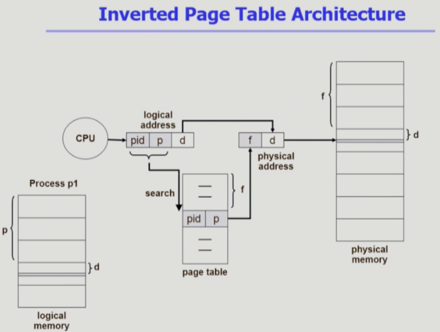
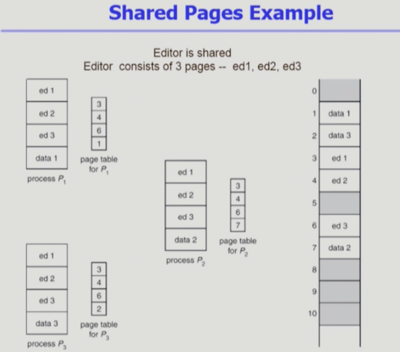
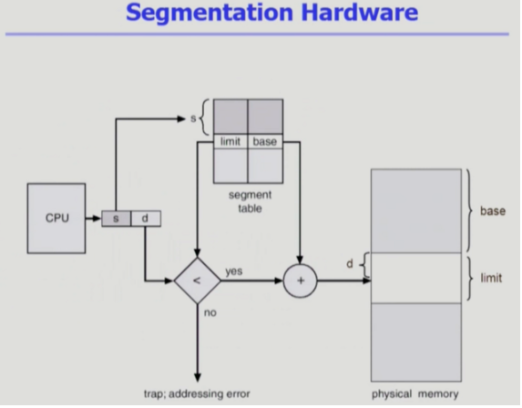
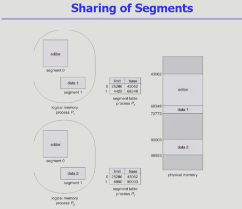
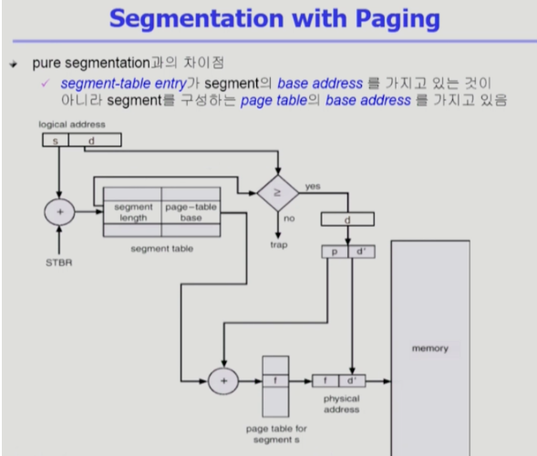

# CS 스터디 - day8_230208

## 운영체제(Operating systems, OS)

### Memory management

1. Logical vs Physical Address
   
   - Logical address(= virtual address)
     
     - 프로세스마다 독립적으로 가지는 주소 공간
     
     - 각 프로세스마다 0번지부터 시작
     
     - CPU가 보는 주소는 logical address임
   
   - Pyhsical address
     
     - 메모리에 실제 올라가는 위치 
   
   - 주소바인딩: 주소를 결정하는 것
     
     - Symbolic Address => Logical Address =>Physical address

2. 주소 바인딩 (Address Binding)
   
   
   
   - Compile time binding
     
     - 물리적 메모리 주소(physical address)가 컴파일 시 알려짐
     
     - 시작 위치 변경시 재컴파일
     
     - 컴파일러는 절대 코드(absolute code) 생성
   
   - Load time binding
     
     - loader의 책임하에 물리적 메모리 주소 부여
     
     - 컴파일러가 재배치가능코드(relocatable code)를 생성한 경우 가능
   
   - Execution time binding(=Run time binding)
     
     - 수행이 시작된 이후에도 프로세스의 메모리 상 위치를 옮길 수 있음
     
     - CPU가 주소를 참조할 때마다  binding을 점검 (address mapping table)
     
     - 하드웨어적인 지원 필요

3. Memory - Management Unit(MMU)
   
   - MMU
     
     - 논리적 주소를 물리적 주소로 매핑해주는 하드웨어 장치
   
   - MMU scheme
     
     - 사용자 프로세스가 CPU에서 수행되며 생성해내는 모든 주소값에 대해 base register(=relocation register)의 값을 더함
   
   - uswer program
     
     - logical address만을 다룬다
     
     - 실제 physical address를 볼 수 없으며 알 필요가 없다

4. Dynamic Loading
   
   - 프로세스 전체를 메모리에 미리 다올리는 것이 아니라 해당 루틴이 불려질 때 메모리에 로드 하는 것
   
   - memory utilization의 향상
   
   - 가끔씩 사용되는 많은 양의 코드의 경우 유용(ex. 오류 처리 루틴)
   
   - 운영체제의 특별한 지원 없이 프로그램 자체에서 구현 가능(OS는 라이브러리를 통해 지원 가능)

5. Overlays
   
   - Dynamic loading과 흡사
   
   - 메모리에 프로세스의 부분 중 실제 필요한 정보만을 올림
   
   - 프로세스의 크기가 메모리보다 클 때 유용
   
   - 운영체제의 지원없이 사용자에 의해 구현
   
   - 작은 공간의 메모리를 사용하던 초창기 시스템에서 수작업으로 프로그래머가 구현
   
   - 프로그래밍이 매우 복잡

6. swapping
   
   - swapping
     
     - 프로세스를 일시적으로 메모리에서 backing store로 쫓아내는 것
   
   - Backing store(=swap area)
     
     - 많은 사용자의 프로세스 이미지를 담을 만큼 충분히 빠르고 큰 저장 공간
   
   - Swap in/ Swap out
     
     - 일반적으로 중기 스케줄러가 swap out할 프로세스를 선정
     
     - 우선 순위 기반 CPU 스케줄링 
       
       - 우선 순위가 낮은 프로세스를 swap out 시킴
       
       - 우선 순위가 높은 프로세스를메모리에 올려놓음\
     
     - 컴파일 타임 바인딩 혹은 로드 타임 바인딩에서는 원래 메모리 위치로 다시 swap in.
     
     - 실행시간 바인딩에서는 빈 메모리 영역 아무데나 올릴 수 있음
     
     - swap time은 대부분 transfer time(swap되는 양에 비례하는 시간)

7. Dynamic Linking
   
   - Linking을 실행 시간(execution time)까지 미루는 기법
   
   - static linking
     
     - 라이브러리가 프로그램의 실행 파일 코드에 포함됨
     
     - 실행 파일의 크기가 커짐
     
     - 동일한 라이브러리를 각각의 프로세스가 메모리에 올리므로 메모리 낭비
   
   - Dynamic linking
     
     - 라이브러리가 실행시 연결(link)됨
     
     - 라이브러리 호출 부분에 라이브러리 루틴의 위치를 찾기 위한  stub이라는 작은 코드를 둠
     
     - 라이브러리가 이미 메모리에 있으면 그 루틴의 주소로 가고 없으면 디스크에서 읽어옴
     
     - 운영체제의 도움이 필요

8. Allocation of Physical Memory
   
   - 메모리는 일반적으로 두 영역으로 나뉘어 사용
     
     - OS 상주 영역: 낮은 영역
     
     - 사용자 프로세스 영역 : 높은 주소 영역
   
   - 사용자 프로세스 영역의 할당 방법
     
     - contiguous allocation(연속할당)
       
       - 각각의 프로세스가 메모리의 연속적인 공간에 적재되도록 하는 것
       
       - 고정 분할 방식
         
         - 물리적 메모리를 몇개의 영구적 분할로 나눔
         
         - 분할의 크기가 모두 동일한 방식과 서로 다른 방식 존재
         
         - 분할당 하나의 프로그램 적재
         
         - 융통성 없음 - 동시에 메모리에 load되는 프로그램 수 고정, 최대 수행 가능 프로그램 크기 제한
       
       - 가변 분할 방식
         
         - 프로그램의 크기를 고려해서 할당
         
         - 분할의 크기, 개수가 동적으로 변함
         
         - 기술적 관리 기법 필요
         
         - External frgmentation 발생
       
       - 
       
       - Hole
         
         - 
         
         - 가용 메모리 공간
         
         - 다양한 크기의 hole들이 메모리 여러 곳에 흩어져 있음
         
         - 프로세스가 도착하면 수용가능한 hole을 할당
         
         - 운영체제는 다음의 정보를 유지
           
           - a) 할당공간 b) 가용공간
     
     - Noncontiguous allocation(불연속할당)
       
       - 하나의 프로세스가 메모리의 여러 영역에 분산되어 올라갈 수 있음
       - paging
       - segmentation
       - paged segmentation

9. Paging
   
   - process의 virtual memory를 동일한 사이즈의 page 단위로 나눔
   
   - virtual memory의 내용이 page 단위로 noncontiguous하게 저장됨
   
   - 일부는 backing strage에 일부는 physical memory에 저장
   
   - basic method
     
     - physical memory를 동일한 크기의 frame으로 나눔
     
     - logical memory를 동일 크기의 page로 나눔(frame과 같은 크기)
     
     - 모든 가용 frame들을 관리
     
     - page table을 사용하여 logical address를 physical address로 변환
     
     - external fragmentation 발생안함
     
     - internal fragmentation 발생가능

10. Multilevel paging and Performance 
    
    - address space가 더 커지면 다단계 페이지 테이블 필요
    
    - 각 단계의 페이지 테이블이 메모리에 존재하므로 logical address의 physical address 변환에 더 많은 메모리 접근 필요
    
    - TLB를 통해 메모리 접근 시간을 줄일 수 있음
    
    - 4단계 페이지 테이블을 사용하는 경우
      
      - 메모리 접근 시간이 100ns, TLB 접근 시간이 20ns이고
      
      - TLB hit ration가 98%인 경우 effective memory access time = 0.98 * 120 + 0.02 * 520 = 128 nanoseconds.
      
      - 결과적으로 주소 변환을 위해 28ns만 소요

11. Memory Protection
    
    - page table의 각 entry마다 아래의 bit를 둔다.
      
      - Protection bit
        
        - page에 대한 접근 권한(read/write/read-only)
      
      - Valid - invalid bit
        
        - 'valid'는 해당 주소의 frame에 그 프로세스를 구성하는 유효한 내용이 있음을 뜻함(접근 허용)
        
        - ''invalid'는 해당 주소의  frame에 유효한 내용이 없음을 뜻함(접근 불허)

12. Inverted Page Table
    
    - page table이 매우 큰 이유
      
      - 모든 process 별로 그 logical address에 대응하는 모든 page에 대해 page table entry가 존재
      
      - 대응하는 page가 메모리에 있든 아니든 간에 page tabble에는 entry로 존재
    
    - Inverted page table
      
      - Page frame 하나당 page table에 하나의 entry를 둔 것 (syste-wide)
      
      - 각 page table entry는 각각의 물리적 메모리의 page frame이 담고 있는 내용 표시(process-id, process의 logical address)
      
      - 단점
        
        - 테이블 전체를 탐색해야 함
      
      - 조치
        
        - associative register 사용(expensive)
      
      

13. Shared page
    
    
    
    - Shared code
      
      - Re-entrant Code (=Pure code)
      
      - read-only로 하여 프로세스 간에 하나의  code만 메모리에 올림
      
      - Shared code는 모든 프로세스의 logical address space에서 동일한 위치에 있어야 함
    
    - Private code and data
      
      - 각 프로세스들은 독자적으로 메모리에 올림
      
      - Private data는 logical address space의 아무 곳에 와도 무방

14. Segmentation
    
    - 의미 있는 크기, 공간별로 자름, 크기가 균일하지 않음
      
      - 작게는 프로세스를 구성하는 주소 공간(함수) 하나하나를 의미 단위로 잘라 세그먼트로 정의
      
      - 크게는 프로그램 전체를 하나의 세그먼트로 정의 가능

15. Segmentation Architecture
    
    
    
    - Logical address는 다음의 두가지로 구성 
      
      - segment-number, offset
    
    - segment table
      
      - base( 물리주소)
      
      - limit(세그먼트의 개수)
    
    - STBR(Segment-table base register)
      
      - 물리적 메모리에서의 segment table의 위치
    
    - STLR(Segment-table length register)
      
      - 프로그램이 사용하는 segment의 수
    
    - Protection
      
      - 각 세그먼트 별로 protection bit가 있음
      
      - each entry
        
        - valid bit = 0 ->illegal segment
        
        - Read/Write/Execution 권한 bit
      
      - Sharing
        
        - shared segment(같은 논리 주소 보유)
        
        - same segment number
        
        - segment는 의미 단위이기 때문에 공유와 보안에 있어서 paging보다 훨씬 효과적이다.
      
      - Allocation
        
        - first fit/best fit
        
        - external fragmentation 발생
        
        - segment의 길이가 동일하지 않으므로 가변 분할 방식에서와 동일한 문제점들이 발생함(단점)

16. Sharing of segments
    
    
    
    - 같은 역할을 하기 떄문에 공유하는 것
    
    - 세그먼트 번호가 같고 물리적인 세그먼트 위치가 같아야한다
    
    - 주소 변환시 같은 주소로 변환. private segment 경우 다른 위치에 적재되어있음

17. Segmentation with Paging
    
    
    
    - segment 하나가 여러 개의 page로 구성
    
    - pure segmentation과의 차이점
      
      - segment-table entry가 segment의 base address 를 가지고 있는 것이 아니라 segment를 구성하는 page table의 base address를 가지고 있음
