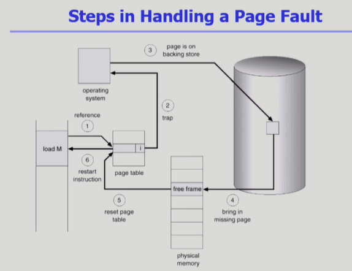
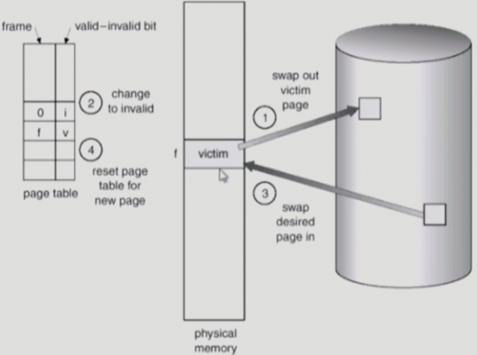
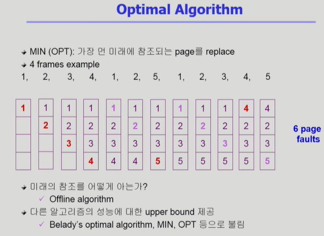
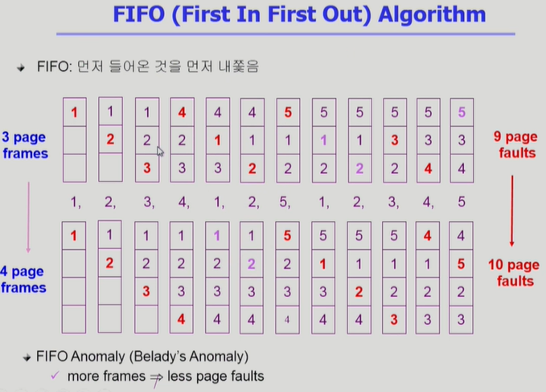
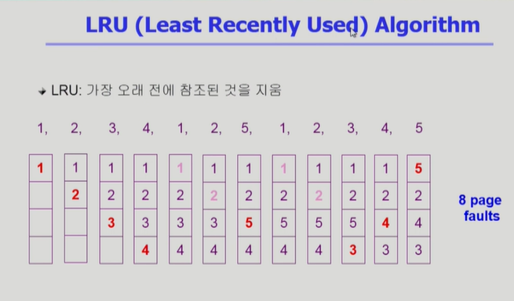
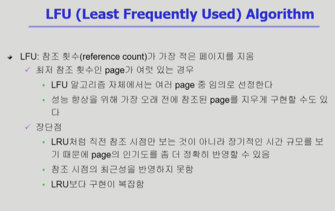
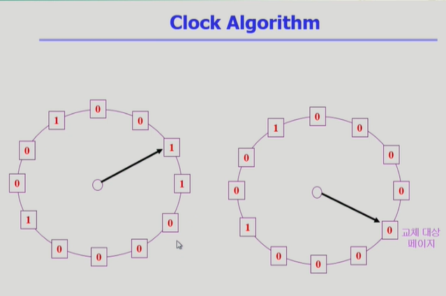
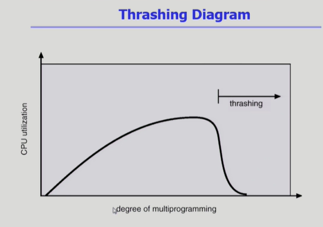
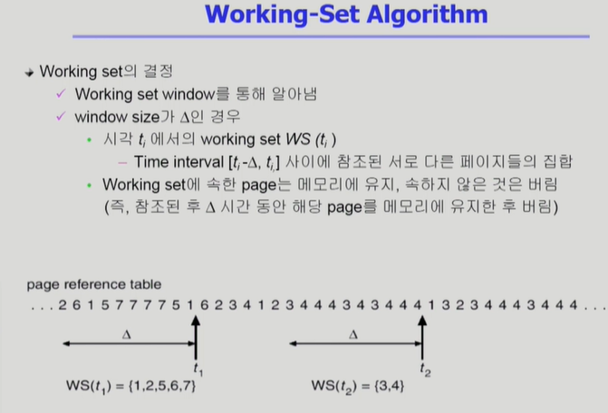
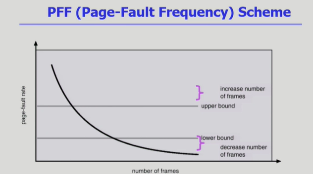

# CS 스터디 - day9_230212

## 운영체제(Operating systems, OS)

### Virtual Memory

1. Demand Paging
   
   - 실제로 필요할 때 page를 메모리에 올리는 것
     
     - I/O 양의 감소
     
     - Memory 사용량 감소
     
     - 빠른 응답 시간
     
     - 더 많은 사용자 수용
   
   - Valid / Invalid bit의 사용
     
     - Invalid의 의미
       
       - 사용되지 않는 주소 영역인 경우
       
       - 페이지가 물리적 메모리에 없는 경우
     
     - 처음에는 모든 page entry가 invalid로 초기화
     
     - address translation시에 invalid bit이 set되어 있으면  => page fault

2. Page Fault
   
   
   
   - Invalid page를 접근하면, MMU가 trap을 발생시킴(page fault trap)
   
   - Kernel mode로 들어가서 page fault handler가 invoke됨
   
   - 다음과 같은 순서로 page fault를 처리한다.
     
     - 1. Invalid reference? (eg. bad address, protection violation) => abort process
       
       2. Get an empty page frame(없으면 뺏어옴:replace)
       
       3. 해당 페이지를 disk에서 memory로 읽어온다
          
          1. disk I/O가 끝나기까지 이 프로세스는 CPU를 preempt 당함(block)
          
          2. Disk read가 끝나면 page tables entry 기록, valid/invalid bit ='valid'
          
          3. ready queue에 process를 insert -> dispatch later
       
       4. 이 프로세스가 CPU를 잡고 다시 running
       
       5. 아까 중단되었던 instruction 재개

3. Free frame이 없는 경우
   
   
   
   - Page replacement
     
     - 어떤 frame을 빼앗아올지 결정해야 함
     
     - 곧바로 사용되지 않을 page를 쫓아내는 것이 좋음
     
     - 동일한 페이지가 여러 번 메모리에서 쫓겨났다가 다시 들어올 수 있음
   
   - Replacement Algorithm
     
     - page-fault rate을 최소화하는 것이 목표
     
     - 알고리즘의 평가
       
       - 주어진 page reference string에 대해 page fault를 얼마나 내는지 조사
     
     - reference string의 예
       
       - 1,2,3,4,1,2,5,1,2,3,4,5

4. Optimal Alogorithm
   
   
   
   - 알고리즘 중 page fault를 가장 적게 함
   
   - optimal algorithm은 미래를 다 알고 있다고 가정한 상태에서 실행, 하지만 실제 시스템에서는 미래를 알 수 없음
   
   - 가장 먼 미래에 참조되는 page를 replace 하는 방법
   
   - 아무리 좋은 알고리즘을 만들어도 optimal algorithm보다 성능이 좋을 순 없음

5. FIFO( First In First Out) Alogorithm
   
   
   
   - 가장 간단한 페이지 교체 알고리즘
   
   - 어떤 페이지를 교체해야할 때 , 메모리가 올라온지 가장 오래된 페이지를 내쫓음
   
   - FIFo Anomaly - 메모리 frame 수를 늘렸는데 오히려 page fault수가 늘어나는 현상

6. LRU(Least Recentrly Used) Algorithm
   
   
   
   - 가장 오랜 기간 동안 사용되지 않은 페이지를 교체하는 것
   
   - 페이지마다 마지막 사용 시간을 유지

7. LFU(Least Frequently Used) Algorithm
   
   
   
   - 참조 횟수가 가장 적은 페이지를 교체하는 것

8. 다양한 캐슁 환경
   
   - 캐슁 기법
     
     - 한정된 빠른 공간(=캐쉬)에 요청된 데이터를 저장해 두었다가 후속 요청시 캐쉬로부터 직접 서비스하는 방식
     
     - paging system 외에도 cache memory, buffer caching, Web caching등 다양한 분야에서 사용
   
   - 캐쉬 운영의 시간 제약
     
     - 교체 알고리즘에서 삭제할 항목을 결정하는 일에 지나치게 많은 시간이 걸리는 경우 실제 시스템에서 사용할 수 없음
     
     - Buffer caching이나 Web caching의 경우
       
       - O(1)에서 O(log n) 정도까지 허용
     
     - Paging system인 경우
       
       - page fault인 경우에만 OS가 관여함
       
       - 페이지가 이미 메모리에 존재하는 경우 참조시각 등의 정1보를 OS가 알 수 없음
       
       - O(1)인 LRU의 list 조작조차 불가능

9. Clock Algorithm
   
   
   
   - LRU의 근사 알고리즘
   
   - 여러 명칭 - Second chance algorithm, NUR(Not Used Recently), NRU(Not Recently Used)
   
   - Reference bit을 사용해서 교체 대상 페이지 선정(circular list)
   
   - Reference bit이 0인 것을 찾을 떄까지 포인터를 하나씩 앞으로 이동
   
   - 포인터 이동하는 중에 Reference bit 가 1인 것은 모두 0으로 바꿈
   
   - 한 바퀴 되돌아와서도(=second chance) 0이면 그때는 replace 당함
   
   - 자주 사용되는 페이지면 second chance가 올 때 1
   
   - Clock Algorithm 개선
     
     - reference bit과 Modified bit을 함께 사용
     
     - reference bit = 1: 최근에 참조된 페이지
     
     - modified bit = 1: 최근에 변경된 페이지

10.  Page Frame의 Allocation
    
    - Allocation Problem - 각 프로세스에 얼마만큼의 page frame을 할당할 것인가
    
    - Allocation의 필요성
      
      - 메모리 참조 명령어 수행 시 명령어, 데이터 등 여러 페이지 동시 참조- 명령어 수행을 위해 최소한 할당되어야 하는 Frame의 수가 있음
      
      - Loop를 구성하는 Page들은 한꺼번에 allocate되는 것이 유리함 - 최소한의 allocation이 없으면 매 loop마다 page fault
    
    - Allocation Scheme
      
      - Equal allocation- 모든 프로세스에 똑같은 개수 할당
      
      - Proportional allocation - 프로세스 크기에 비례하여 할당
      
      - Priority allocation - 프로세스의 Priority에 따라 다르게 할당

11. Global vs Local Replacement
    
    - Global replacement
      
      - Replace 시 다른 프로세스에 할당된 frame을 빼앗아 올 수 있다.
      
      - Process별 할당량을 조절하는 또 다른 방법임
      
      - FIFO, LRU, LFU 등의 알고리즘을 global replacement 로 사용시에 해당
      
      - Working set, PFF 알고리즘 사용
    
    - Local replacement
      
      - 자신에게 할당된 frame  내에서만 replacement
      
      - FIFO, LRU, LFU 등의 알고리즘을 process 별로 운영시

12. Thrashing
    
    
    
    - 프로세스의 원활한 수행에 필요한 최소한의 페이지 프레임 수를 할당 받지 못한 경우 발생
    
    - page fault rate이 매우 높아짐
    
    - CPU utilization이 낮아짐
    
    - OS는 MPD(Multprogramming degree)를 높여야 한다고 판단
    
    - 또 다른 프로세스가 시스템에 추가됨(higher MPD)
    
    - 프로세스 당 할당된 프레임의 수가 더욱 감소
    
    - 프로세스는  page의 swap in/swap out으로 매우 바쁨
    
    - 대부분의 시간에 CPU는 한가함
    
    - low throughput

13.  Working-Set Model
    
    - Locality of reference
      
      - 프로세스는 특정 시간 동안 일정 장소만을 집중적으로 참조한다
      
      - 집중적으로 참조되는 해당 page들의 집합을 locality set이라 함
    
    - Working-set Model
      
      - Locality에 기반하여 프로세스가 일정 시간 동안 원활하게 수행되기 위해 한꺼번에 메모리에 올라와 있어야 하는 page들의 집합을 Working set이라 정의
      
      - Working Set 모델에서는 process의 working set 전체가 메모리에 올라와 있어야 수행되고 그렇지 않을 경우 모든 frame을 반납한 후 swap out(suspend)
      
      - Thrashing을 방지함
      
      - Multiprogramming degree를 결정

14.  Working-Set Algorithm
    
    - Working set의 결정
      
      - 

15. PFF(Page-Fault Frequency) Scheme
    
    
    
    - Page-fault rate의 상한값과 하한값을 둔다
      
      - Page fault rate이 상한값을 넘으면 frame을 더 할당한다
      
      - Page fault rate이 하한값 이하이면 할당 frame 수를 줄인다
    
    - 빈 frame이 없으면 일부 프로세스를 swap out

16. Page size의 결정
    
    - Page size를 감소시키면
      
      - 페이지 수 증가
      
      - 페이지 테이블 크기 증가
      
      - Internal fragmentation 감소
      
      - Disk transfer의 효율성 감서
        
        - Seek/rotation vs transfer
      
      - 필요한 정보만 메모리에 올라와 메모리 이용이 효율적
        
        - Locality의 활용 측면에서는 좋지 않음
    
    - Trend
      
      - Larger page size
    
    
