# CS 스터디 - day10_230213

## 운영체제(Operating systems, OS)

### File Systems

1. File and File System
   
   - File
     
     - "a named collection of related information"
     
     - 일반적으로 비휘발성의 보조기억장치에 저장
     
     - 운영체제는 다양한 저장 장치를  file이라는 동일한 논리적 단위로 볼 수 있게 해 줌
     
     - Operation
       
       - create, read, write, reposition(lseek), delete, open, close 등
   
   - FIle attribute(혹은 file의 metadata)
     
     - 파일 자체의 내용이 아니라 파일을 관리하기 위한 각종 정보들
       
       - 파일 이름, 유형, 저장된 위치, 파일 사이즈
       
       - 접근 권한(읽기/쓰기/실행), 시간(생성/변경/사용), 소유자 등
   
   - File system
     
     - 운영체제에서 파일을 관리하는 부분
     
     - 파일 및 파일의 메타데이터, 디렉토리 정보 등을 관리
     
     - 파일의 저장 방법 결정
     
     - 파일 보호 등

2.  Directory and Logical Disk
   
   - Directory
     
     - 파일의 메타데이터 중 일부를 보관하고 있는 일종의 특별한 파일
     
     - 그 디렉토리에 속한 파일 이름 및 파일 attribute  들
     
     - Operation
       
       - search for a file, create a file, delete a file
       
       - list a directory, rename a file, traverse the file system
   
   - Partition(=Logical Disk)
     
     - 하나의 (물리적) 디스크 안에 여러 파티션을 두는게 일반적
     
     - 여러 개의 물리적인 디스크를 하나의 파티션으로 구성하기도 함
     
     - (물리적) 디스크를 파티션으로 구성한 뒤 각각의 파티션에 file system을 깔거나  swapping 등 다른 용도로 사용할 수 있음

3. Open()
   
   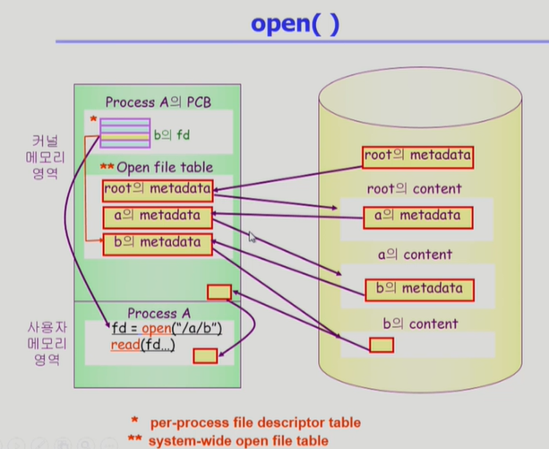
   
   - open: file의 metadata를 memory로 올려놓는  것
   
   - Directory path의 search 에 너무 많은 시간 소요
     
     - open을 reaed/ write와 별도로 두는 이유
     
     - 한번 open한 파일은 read / write 시 directory search 불필요
   
   - Open file table
     
     - 현재 open 된 파일들의 메타데이터 보관소(in memroy)
     
     - 디스크의 메타데이터보다 몇 가지 정보가 추가
       
       - open한 프로세스의 수
       
       - File offset: 파일 어느 위치 접근 중인지 표시 (별도 테이블 필요)

4. File Protection
   
   - 각 파일에 대해 누구에게 어떤 유형의 접근을 허락할 것인가
   
   - Acess Control 방법 3가지
     
     - Access control Matrix
       
       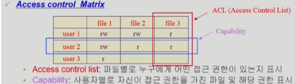
       
       - 2차원 행렬로 관리하게 되면 권한이 없는 사용자나  file에 대한 메모리가 많이 낭비됨
     
     - Grouping
     
     - Password
       
       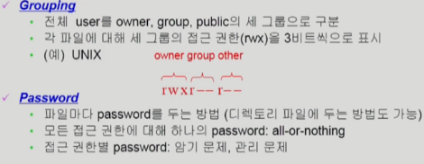

5.  Access Methods
   
   - 순차 접근    
     
     - 카세트 테이프를 사용하는 방식처럼 접근
     
     - 읽거나 쓰면 offset은 자동으로 증가
   
   - 직접 접근(direct access, random access)
     
     - LP 레코드 판과 같이 접근하도록 함
     
     - file을 구성하는 레코드를 임의의 순서로 접근할 수 있음

### File Systems Implementation

1.  Allocation of File Data in Disk
   
   - Contiguous Allocation (연속할당)
     
     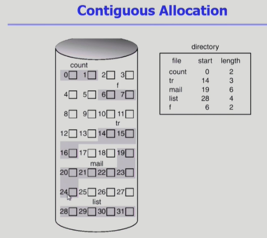
     
     - 하나의 file이 disk 상에 연속해서 저장되는 방법. 
     
     - directory 라는 file은 directory 밑에있는 file들의 metadata들을 내용으로 한다.
     
     - 단점
       
       - external fragmentatin
       
       - File grow가 어려움
     
     - 장점
       
       - Fast I/O
         
         - 한번의 seek/rotation으로 많은 바이트 transfer
         
         - Realtime file 용으로, 또는 이미 run 중이던 process의 swapping용
       
       - Direct acess 가능
   
   - Linked Allocation
     
     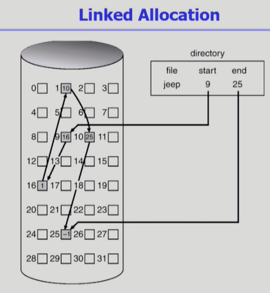
     
     - file을 연속적으로 배치하지 않고 빈 위치면 아무곳이나 배치 시킴
     
     - 장점
       
       - external fragmentation 발생 안함
     
     - 단점
       
       - random acess(직접 접근) 불가능 -> 시간 오래걸림
       
       - reliability 문제
         
         - 한 sector가 고장나 pointer가 유실되면 많은 부분을 잃음
       
       - Pointer 를 위한 공간이 block의 일부가 되어 공간 효율성을 떨어뜨림
         
         - 512bytes/sector, 4 bytes/pointer
     
     - 변형
       
       - File - allocation table (FAT) 파일 시스템
         
         - 포인터를 별도의 위치에 보관하여 reliability와 공간 효율성 문제 해결
   
   - Indexed Allocation
     
     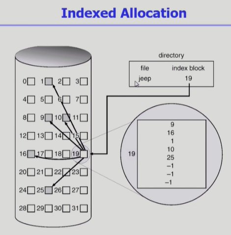
     
     - directory에 file의 위치정보를 바로 저장하는 것이 아니라 먼저 index를 가리키게 한다. index block은 내용을 담고 있지 않고 file이 어디어디에 저장되어있따는 위치정보를 열거해놓는 목록임
     
     - 장점
       
       - External fragmentation이 발생하지 않음
       
       - Direct access 가능
     
     - 단점
       
       - Small file의 경우 공간 낭비(실제로는 많은 file들이 small)
       
       - Too Large file의 경우 하나의 block으로 index를 저장하기에 부족
         
         - 해결방안
           
           - linked scheme
           
           - multi-level index

2.  UNIX 파일 시스템 구조
   
   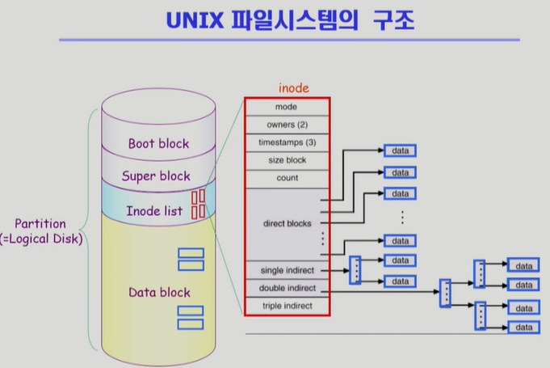
   
   - boot block은 모든 file system에서 가장 먼저나옴
   
   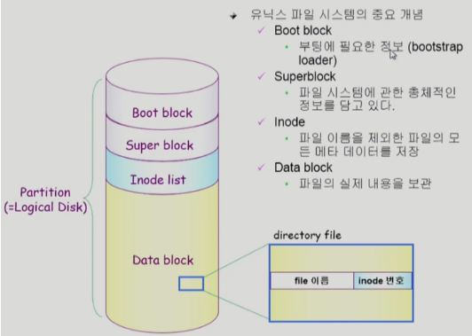
   
   - super block: 어디가 빈 블록이고 어디가 data가 저장되어 있는 블록인지 관리

3. FAT File System
   
   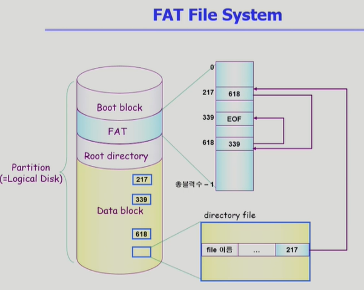
   
   - file의 matadata 중 일부(위치정보만)를  FAT에 보관
   
   - FAt에는 그 블록의 다음 블록을 번호로 저장
   
   - Linked allocation 적용한 것이지만 변형하여 직접접근 가능
   
   - pointer 하나가 유실되더라도 FAT에 내용이 있기 때문에 괜찮음

4.  Free -Space Management
   
   - Bit map or bit vector
     
     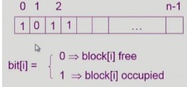
     
     - bit map은 부가적인 공간을 필요로 함
     
     - 연속적인 n개의 free block을 찾는데 효과적
   
   - Linked list
     
     - 모든 free block들을 link로 연결(free list)
     
     - 연속적인 가용공간을 찾는 것은 쉽지 않다
     
     - 공간의 낭비가 없다.(장점)
   
   - Grouping
     
     - linked list 방법의 변형
     
     - 첫 번째 free block이 n개의 pointer를 가짐
       
       - n-1 pointer는 free data block을 가리킴
       
       - 마지막 pointer가 가리키는 block은 또 다시 n pointer를 가짐
   
   - Counting
     
     - 프로그램들이 종종 여러개의 연속적인 block을 할당하고 반납한다는 성질에 착안

5.  Directory Implementation
   
   - Linear list
     
     - `<file name, file의 metadata>`의 list
     
     - 구현이 간단
     
     - 디렉토리 내에 파일이 있는지 찾기 위해서는  linear search 필요
   
   - Hash Table
     
     - linear list + hashing
     
     - hash table은 file name을 이 file의 linear list의 위치로 바꿔줌
     
     - search time을 없앰
     
     - collision 발생 가능
   
   - File의 metadata 보관위치
     
     - 디렉토리 내에 직접 보관
     
     - 디렉토리에는 포인터를 두고 다른 곳에 보관
       
       - inode, FAT 등
   
   - Long file name의 지원
     
     - `<file name, file의 metadata>`의 list에서 각 entry는 일반적으로 고정크기
     
     - file name이 고정 크기의 entry 길이보다 길어지는 경우 entry의 마지막 부분에 이름의 뒷부분이 위치한 곳의 포인터를 두는 방법
     
     - 이름의 나머지 부분은 동일한 directory file의 일부에 존재

6.  VFS and NFS
   
   - VFS(Virtual File System)
     
     - 서로 다른 다양한 file system 에 대해 동일한 시스템 콜 인터페이스(API)를 통해 접근할 수 있게 해주는 OS의 layer
   
   - NFS(Network File System)
     
     - 분산 시스템에서는 네트워크를 통해 파일이 공유될 수 있음
     
     - NFS는 분산 환경에서의 대표적인 파일 공유 방법

7.  Page cache and buffer cache
   
   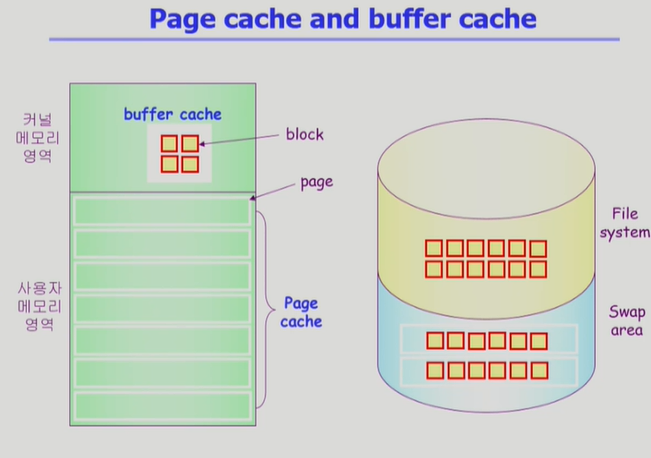
   
   - Page cache
     
     - virtual memory의 paging system에서 사용하는 page frame을 caching의 관점에서 설명하는 용어
     
     - memory-mapped I/O를 쓰는 경우 file의 I/O에서도 page cache 사용
   
   - Memory-Mapped I/O
     
     - file의 일부를 virtual memory에 mapping시킴
     
     - 매핑시킨 영역에 대한 메모리 접근 연산은 파일의 입출력을 수행하게 함
   
   - Buffer cache
     
     - 파일 시스템을 통한 I/O 연산은 메모리의 특정 영역인 buffer cache 사용
     
     - file 사용의 locality 활용
     
     - 모든 프로세스가 공용으로 사용
     
     - replacement algorithm 필요(LRU, LFU 등)
   
   - Unified Buffer Cache
     
     - 최근의 OS에서는 기존의 buffer cache가 page cache에 통합
   
   
