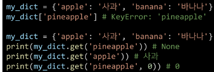

# Python 데이터 구조(Data structure)2

1. 순서가 없는 데이터 구조
   
   - 셋(Set)
     
     - 중복되는 요소가 없이, 순서에 상관없는 데이터들의 묶음
     
     - <mark>중복 x, 순서 x, 인덱스로 접근 불가</mark>
     
     - 집합 연산이 가능(여집합을 표현하는 연산자는 별도로 존재x)
   
   - 딕셔너리(Dictionary)
     
     - key-value 쌍으로 이뤄진 자료형(3.7부터는 ordered, 이하 버전은 unordered)
     
     - key는 변경 불가능한 데이터(immutable)만 할용가능
       
       - ex) string, integer, float, boolean, tuple, range
     
     - value 는 형태 상관없음
     
     - dictionary 메서드 get은 key가 없으면 none 을 반환
     
     - 
       
       

2. 얕은 복사와 깊은 복사
   
   - 얕은 복사: 한정된 메모리를 효율적으로 사용하기 위함
     
     - 대입연산자(`=`)을 사용해 리스트 복사 
     
     - 같은 주소를 가짐
     
     - Slice 연사자를 활용한 복사
     
     - 다른 주소를가짐
     
     - <mark>얕은 복사 주의사항</mark>: 복사하는 리시트의 원소가 주소를 참조하는경우
     
     - 리스트 안의 리스트의 주소까지 깊은 복사가 되지 않는다.!!!!
     
     - 리스트안의 리스트 같은 주소를 참조하고있기 때문
     
     - 깊은 복사를 하기 위해서는 copy모듈의 deep copy 사용
     
     - 
     
     - 리스트안의 리스트 의 주소까지 복사함

