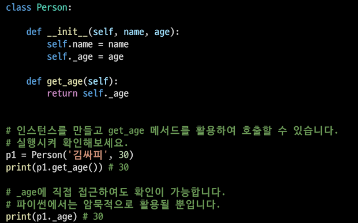

# Python 객체 지향 프로그래밍2

1.  객체 지향 프로그래밍
   
   - 객체지향의 핵심 4가지
     
     - 추상화: 핵심이 되는 부분만 추리기
     
     - 상속: 코드의 재사용성을 향상 + 기능을 확장
       
       - 두 클래스 사이 부모 - 자식 관계를 정립하는 것
       
       - `class ChildClass(ParentClass):`
       
       - 하위 클래스는 상위 크래스에 정의된 속성, 행동, 관계 및 제약 조건을 모두 상속 받음
       
       - 부모클래스의 속성, 메서드가 자식 클래스에 상속되므로, 코드 재사용성이 높아짐
       
       - `super()`: 자식 클래스에서 부모클래스를 사용하고 싶은 경우
       
       - 상속관계에서의 이름 공간은 이느턴스, 자식 클래스, 부모 클래스 순으로 탐색
       
       - 다중상속
         
         - 두개 이상의 클래스를 상속 받는 경우
         
         - 상속 받은 모든 클래스의 요소를 활용 가능
         
         - 중복된 속성이나 메서드가 있는 경우 <mark>상속 순서에 의해 결정</mark>됨
         
         - mro  메서드(`.mro`)
           
           - 해당 인스턴스의 클래스가 어떤 부모 클래스를 가지는지 확인하는 메서드
     
     - 다형성: 각자의 특성에 따라 다른 결과 만들기
       
       - 서로 다른 클래스에 속해있는 객체들이 동일한 메시지에 대한 다른 방식으로 응답할 수 있음
       
       - 메서드 오버라이딩
         
         - 상속받은 메서드를 재정의
           
           - 상속받은 클래스에서 같은 이름의 메서드로 덮어씀
           
           - 부모 클래스의 메서드를 실행시키고 싶은 경우  supter를 활용
     
     - 캡슐화: 데이터 보호하기
       
       - 객체의 일부 구현 내용에 대해 외부로부터의 직접적인 엑세스를 차단 ex) 주민등록번호
       
       - 접근제어자 종류
         
         - Public Access Modifier : 모두 가능
           
           - 언더바 없이 시작하는 메서드나 속성
           
           - 어디서나 호출이 가능, 하위 클래스 override 허용
           
           - 일반적으로 작성되는 메서드나 속성의 대다수를 차지
         
         - Protected Access Modifier : 상속 관계에서만 가능
           
           - 언더바 1개로 시작하는 메서드나 속성
           
           - 암묵적 규칙에 의해 부모 클래스 내부와 자식 클래스에서만 호출 가능
           
           - 하위 클래스 override 허용
           
           - 실행이 되지만 암묵적 규칙
         
         - Private Access Modifier : 나만 가능
           
           - 언더바 2개로 시작하는 메서드나 속성
           
           - 본 클래스 내부에서만 사용이 가능
           
           - 하위클래스 상속 및 호출 불가능 (오류)
           
           - 외부 호출 불가능
         
         -  getter 메서드와 setter 메서드
           
           - 변수에 접근할 수 있는 메서드를 별도로 생성
             
             - getter 메서드: 변수의 값을 읽는 메서드
               
               - `@property` 데코레이터 사용
             
             - setter 메서드: 변수의 값을 설정하는 성격의 메서드
               
               - `@변수.setter` 사용
           
           - 

2. 에러와 예외처리
   
   - 예외(Exception)
     
     - 실행 도중 예상치 못한 상황을 맞이하면, 프로그램 실행을 멈춤
     
     - 실행 중에 감지되는 에러들을 예외(Exception)라고 부름
     
     - 예외는 여러 타입(type)으로 나타나고, 타입이 메시지의 일부로 출력
     
     - 모든 내장 예외는 Exception Class를 상속받아 이뤄짐
     
     - 사용자 정의 예외를 만들어 관리할 수 있음
       
       
   
   

