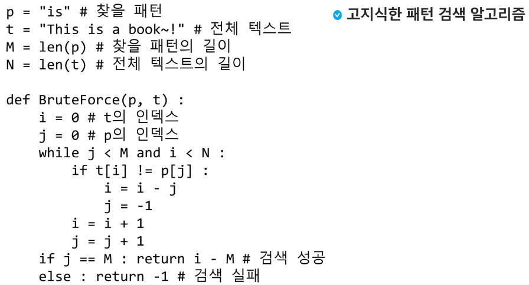
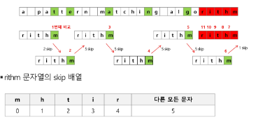

# Algorithm 문자열(String)

1. 패턴 매칭에 사용되는 알고리즘들
   
   - 고지식한 패턴 검색 알고리즘
     
     - 본문 문자열을 처음부터 끝까지 차례대로 순회하면서 패턴 내의 문자들을 일일이 비교하는 방식으로 동작
     
     - 
       
       
   
   - KMP 알고리즘
     
     - 불일치가 발생한 텍스트 스트링의 앞 부분에 어떤 문자가 있는지를 미리 알고 있으므로, 불일치가 발생한 앞 부분에 대하여 다시 비교하지 않고 매칭을 수행
   
   - 보이어- 무어 알고리즘
     
     - 오른쪽에서 왼쪽으로 비교
     
     - 대부분의 상용 소프트웨어에서 채택하고 있는 알고리즘
     
     - 보이어 무어 알고리즘은 패턴에 오른쪽 끝에 있는 문자가 불일치 하고 이 문자가 패턴 내에 존재하지 않는 경우, 이동 거리는 무려 패턴의 길이 만큼이 된다.
     
     - 

