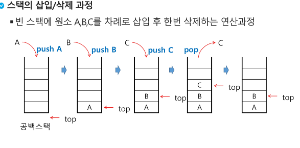
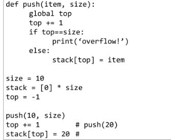
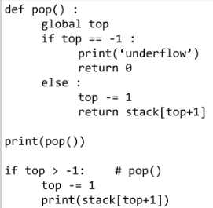

# Algorithm Stack1

1. 스택(stack)의 특성
   
   - 물건을 쌓아 올리듯 자료를 쌓아 올린 형태의 자료구조
   
   - 스택에 저장된 자료는 선형 구조를 갖는다.
     
     - 선형구조: 자료 간의 관계가 1대1의 관계를 갖는다.
     
     - 비선형구조: 자료 간의 관계가 1대N의 관계를 갖는다.(예: 트리)
   
   - 스택에 자료를 삽입하거나 스택에서 자료를 꺼낼 수 있다.
   
   - 마지막에 삽입한 자료를 가장 먼저 꺼낸다. 후입선출(LIFO, Last-In-First-Out)이라고 부름
     
     - ex) 스택에 1,2,3 순으로 자료를 삽입한 후 꺼내면 역순으로 3,2,1 순으로 꺼낼 수 있음
   
   - 스택을 프로그램에서 구현하기 위해 필요한 자료구조와 연산
     
     - 자료구조: 자료를 선형으로 저장할 저장소
       
       - 배열을 사용할 수 있음
       
       - 저장소 자체를 스택이라고 부름
       
       - 스택에서 마지막 삽입된 원소의 위치를 top이라 부름
     
     - 연산
       
       - 삽입: 저장소에 자료를 저장한다. 보통 `push`라 부름
       
       - 삭제: 저장소에서 자료를 꺼냄. 꺼낸 자료는 삽입한 자료의 역순으로 꺼냄. 보통 `pop`이라 부름
       
       - 스택이 공백인지 아닌지를 확인하는 연산. `isEmpty`
       
       - 스택의 top에 있는 item(원소)을 반환하는 연산. `peek`  
   
   - 스택의 삽입/삭제 과정
     
     
   
   - 스택의 push 알고리즘
     
     - append 메소드를 통해 리스트의 마지막에 데이터를 삽입
     
     - ```python
       def push(item):
           s. append(item)
       ```
     
     - 
   
   - 스택의 pop 알고리즘
     
     - 
   
   - 
     
     
     
      
