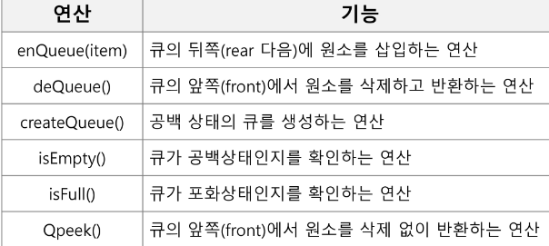

# Algorithm Queue1

1.  큐(Queue)의 특성
   
   - 스택과 마찬가지로 삽입과 삭제의 위치가 제한적인 자료구조
     
     - 큐의 뒤에서는 삽입만 하고, 큐의 앞에서는 삭제만 이루어지는 구조
   
   - 선입선출구조(FIFO: First In First Out)
     
     - 큐에 삽입한 순서대로 우너소가 저장되어, 가장 먼저 삽입(First In) 된 원소는 가장 먼저 삭제(First Out)된다.
   
   - 큐의 기본 연산
     
     - 삽입 : enQueue
     
     - 삭제 : deQueue
     
     - 

2.  큐의 구현
   
   - 선형큐
     
     - 1차원 배열을 이용한 큐
       
       - 큐의 크기 = 배열의 크기
       
       - front : 저장된 첫 번째 원소의 인덱스 (마지막으로 삭제된 인덱스)
       
       - rear : 저장된 마지막 원소의 인덱스
     
     - 상태 표현
       
       - 초기 상태: front = rear = -1
       
       - 공백 상태: front == rear
       
       - 포화 상태: rear == n-1 (n:배열의 크기, n-1: 배열의 마지막 인덱스)
     
     - 초기 공백 큐 생성
       
       - 크기 n인 1차원 배열 생성
       
       - front와 rear를 -1로 초기화

