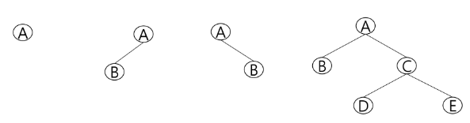
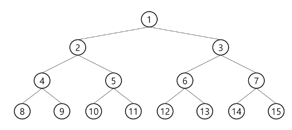
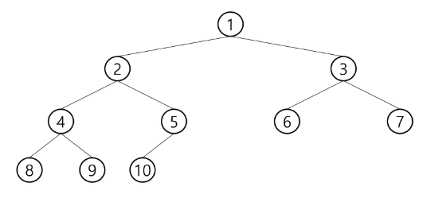
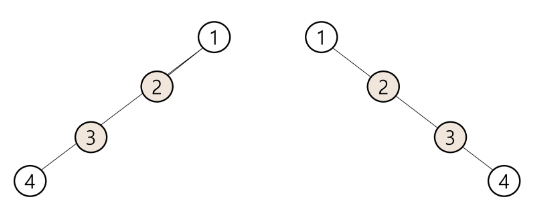
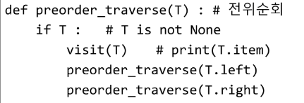
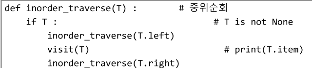
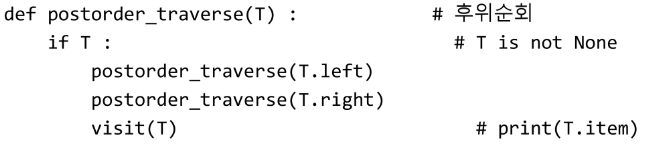

# Algorithm Tree1

1. 트리
   
   - 트리의 개념
     
     - 비선형 구조
     
     - 원소들 간에 1:n 관계를 가지는 자료구조
     
     - 원소들 간에 계층관계를 가지는 계층형 자료구조
     
     - 상위 원소에서 하위 원소로 내려가면서 확장되는 트리(나무)모양의 구조
   
   - 트리의 용어
     
     - 노드- 트리의 원소
     
     - 간선 - 노드를 연결하는 선, 부모노드와 자식노드를 연결
     
     - 루트 노드(root node) -  트리의 시작 노드
     
     - 형제 노드(sibling node) - 같은 부모 노드의 자식 노드들
     
     - 조상 노드 - 간선을 따라 루트 노드까지 이르는 경로에 있는 모든 노드들
     
     - 서브 트리(subtree) - 부모 노드와 연결된 간선을 끊었을 떄 생성되는 트리
     
     - 자손 노드 - 서브 트리에 있는 하위 레벨의 노드들
     
     - 차수(degree)
       
       - 노드의 차수 : 노드에 연결된 자식 노드의 수
       
       - 트리의 차수 : 트리에 있는 노드의 차수 중에서 가장 큰 값
       
       - 단말 노드(리프 노드): 차수가 0인 노드, 자식 노드가 없는 노드
     
     - 높이
       
       - 노드의 높이: 루트에서 노드에 이르는 간선의 수, 노드의 레벨
       
       - 트리의 높이: 트리에 있는 노드의 높이 중에서 가장 큰 값, 최대 레벨

2. 이진트리
   
   - 모든 노드들이 2개의 서브트리를 갖는 특별한 형태의 트리
   
   - 각 노드가 자식 노드를 최대한 2개 까지만 가질 수 있는 트리
     
     - 왼쪽 자식 노드(left child node)
     
     - 오른쪽 자식 노드(right child node)
   
   - 이진 트리의 예
     
     - 
   
   - 이진트리 종류
     
     - 포화 이진 트리 (Full Binary Tree)
       
       - 모든 레벨에 노드가 포화상태로 차 있는 이진 트리
       
       - 높이가 h일 때, 최대의 노드 개수인 (`2**h+1 -1`)의 노드를 가진 이진 트리 
         
         - 높이 3일때 (2**(3+1) -1) = 15개의 노드
       
       - 
     
     - 완전 이진 트리 (Complete Binary Tree)
       
       - 높이가 h이고 노드 수가 n개일 때(단, `2**h<=n<2**(h+1)-1`), 포화 이진 트리의 노드 번호 1번부터 n번까지 빈 자리가 없는 이진 트리
       
       - 
     
     - 편향 이진 트리 (Skewed Binary Tree)
       
       - 높이 h에 대한 최소 개수의 노드를 가지면서 한쪽 방향의 자식 노드만을 가진 이진 트리
         
         - 왼쪽 편향 이진 트리
         
         - 오른쪽 편향 이진 트리
       
       - 
   
   - 이진트리 - 순회(traversal)
     
     - 순회란 트리의 각 노드를 중복되지 않게 전부 방문(visit)하는 것을 말하는데 트리는 비 선형 구조이기 때문에 선형구조에서와 같이 선후 연결관계를 알 수 없다.
     
     - 3가지 기본적 순회방법
       
       - 전위순회(preorder traversal): VLR
         
         - 부모노드 방문 후, 자식노드를 좌, 우 순서로 방문한다.
         
         - 
       
       - 중위순회(inorder traversal): LVR
         
         - 왼쪽 자식노드, 부모노드, 오른쪽 자식노드 순으로 방문한다.
         
         - 
       
       - 후위순회(postorder traversal): LRV
         
         - 자식노드를 좌우 순서로 방문한 후, 부모노드로 방문한다.
         
         - 
     
     
     
     

