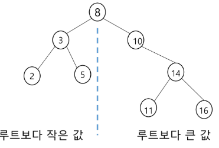
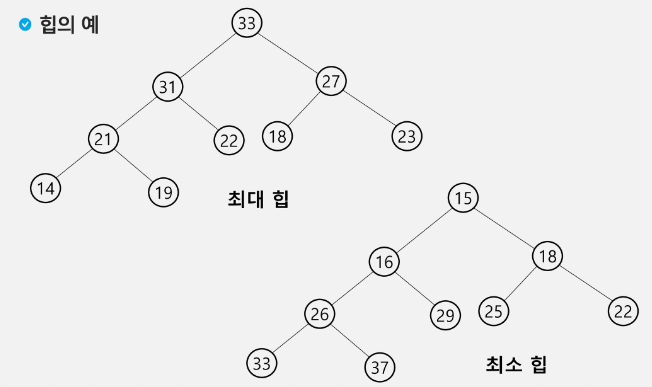

# Algorithm Tree2

1. 이진 탐색 트리
   
   - 탐색작업을 효율적으로 하기 위한 자료구조
   
   - 모든 우너소는 서로 다른 유일한 키를 갖음
   
   - key(왼쪽 서비트리)<key(루트 노드)<key(오른쪽 서브트리)
   
   - 왼쪽 서브트리와 오른쪽 서브트리도 이진 탐색 트리
   
   - 중위 순회하면 오름차순 정렬값 얻음
   
   - 

2. 힙(heap)
   
   - 완전 이진 트리에 있는 노드 중에서 키값이 가장 큰 노드나 키값이 가자으 작은 노드를 찾기 위해서 만든 자료구조
   
   - 최대 힙(max heap)
     
     - 키값이 가장 큰 노드를 찾기 위한 완전이진 트리
     
     - (부모노드의 키값 > 자식노드의 키값)
     
     - 루트 노드: 키값이 가장 큰 노드
   
   - 최소 힙(min heap)
     
     - 키값이 가장작은 노드를 찾기 위한 완전 이진 트리
     
     - (부모노드의 키 값< 자식노드의 키값)
     
     - 루트 노드: 키값이 가장 작은 노드
   
   - 

