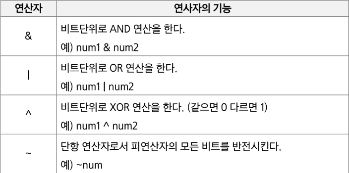
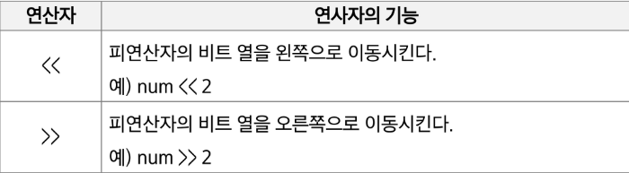
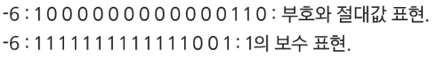
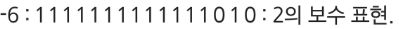

# Alogorithm remind

1. 비트 연산
   
   - 비트 연산자
     
     
     
     
     
     - `1<<n`
       
       - 2**n의 값을 가짐
       
       - 원소가 n개일 경우 모든 부분집합의 수를 의미
       
       - Power set(모든 부분 집합)
         
         - 공집합과 자기 자신을 포함한 모든 부분집합
         
         - 각 원소가 포함되거나 포함되지 않는 2가지 경우의 수를 계산하면 모든 부분집합의 수가 계산됨
     
     - i &(1<<j)
       
       - 계산 결과는 i의 j번째 비트가 1인지 아닌지를 의미

2.  진수
   
   - 10진수 -> 타진수로 변환
     
     - 원하는 타진법의 수로 나눈 뒤 나머지를 거꾸로 읽음
   
   - 컴퓨터에서의 음의 정수 표현 방법
     
     - 1의 보수: 부호와 절대값으로 표현된 값을 부호 비트를 제외한 나머지 비트들을 -은 1로 , 1은 0로 변환
       
       - 
     
     - 2의 보수 :  1의 보수방법으로 표현된 값의 최하위 비트에 1을 더함
       
       - 

3.  실수
   
   - 실수의 표현
     
     - 컴퓨터는 실수를 표현하기 위해 부동 소수점(floating-point) 표기법을 사용
     
     - 부동 소수점 표기 방법은 소수점의 위치를 고정시켜 표현하는 방식
       
       - 소수점의 위치를 왼쪽의 가장 유효한 숫자 다음으로 고정시키고 밑수의 지수승으로 표현
       
       - 
     
     - 실수를 근사적으로 표현함
       
       - 이진법으로 표현할 수 없는 형태의 실수는 정확한 값이 아닌 근사값으로 저장되는데 이때 생기는 작은 오차가 계산 과정에서 다른 결과를 가져옴

