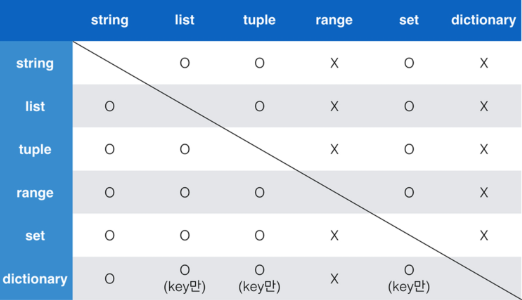

# Python_230116 프로그래밍과 데이터

## 

## python  기초문법

1.  변수와 식별자
   
   - 변수(variable): 데이터를 저장하기 위해 사용 <->상수
   
   - 변수 사용 이유: 코드 가독성 증가, 코드 수정 용이해짐
   
   - 변수의 할당:  `=`을 통해 값을 할당, 같은 값을 동시에 할당 가능, 다른 값을 동시에 할당가능
   
   - 식별자(Identifiers): 변수의 이름을 식별자라고 함 ex) 변수,함수,클래스...
   
   - 식별자 규칙: 
     
     - 식별자의 이름은 영문 알파벳, 언더스코어(_), 숫자로 구성
     
     - 내장 함수나 모듈 등의 이름 사용 x
     
     - 첫 글자에 숫자x
     
     - 길이 제한 없고 대소문자 구별
   
   - 주석(comment) : 코드의 실행에 미치지 않는 메모 `#`, 주석다는 습관 갖기 
   
   

2.  연산자
   
   - 사칙연산 : `+, -, *, /, //, **`
   
   

3. 자료형
   
   - 변수는 메모리의 주소를 기억하는 이름,  메모리 주소 알고싶으면 `id(변수명)`
   
   - 우리는 변수를 이용해 데이터를 기억
   
   - 자료형 마다 차지하는 메모리의 크기가 다름
   
   - 자료형 분류
     
     - 수치형(Numeric Type): 실수를 다룰 때는 부동소수점 조심
     
     - 문자열 (String Type): 모든 문자는 str 타입
     
     - None: 값이 없음을 표현, 일반적으로 반환 값이 없는 함수에서 사용하기도 함
     
     - 불린형(Boolean): 참(True)과 거짓(False) 표현하는 자료형
       
       - Falsy : False는 아니지만 False로 취급 되는 다양한 값 ex)0, 0.0, (), [],None...
       
       - 논리 연산자도 우선순위 존재: not,and,or 순으로 우선순위가 높음(괄호쓰면 된다.)
       
       - 논리 연산자 단축 평가: 결과가 확실한 경우 두번째 값은 확인하지 않고 첫번째 값 반환
         
         - and 연산에서 첫번쨰 값 False인 경우 무조건 False -> 첫번째 값 반환
         
         - or 연산에서 첫번쨰 값이 True인 경우 무조건 True -> 첫번째 값 반환
     
     - 컨테이너: 여러 개의 값(데이터)을 담을 수 있는 것(객체)으로, 서로 다른 자료형을 저장할 수 있음 ex) List
       
       - 컨테이너 분류 : 순서가 있는 데이터(Ordered) vs 순서가 없는 데이터(Unordered), 
       
       - 시퀀스형: 리스트,튜플,레인지
         
         - 리스트(List): 대괄호 `[]`, `list()`를 통해 생성, 파이썬에서 어떠한 자료형도 저장가능, 가변 자료형
         
         - 튜플 : 소괄호 `()`, `tuple()`를 통해 생성, 불변 자료형
         
         - 레인지(Range): 숫자의 시퀀스를 나타내기 위해 사용, 주로 반복문과 함께 사용
         
         - 슬라이싱 연산자:  시퀀스를 특정 단위로 슬라이싱, 인덱스와 콜론을 사용하여 문자열의 특정 부분만 잘라낼 수 있음
       
       - 비시퀀스형: 세트, 딕셔너리
         
         - 딕셔너리(Dictionary): 키-값(key-value) 쌍으로 이뤄진 자료형(3.7부터는 oredred, 하지만 비시퀀스로 아직 본다 슬라이싱안댐,인덱싱 안댐)
           
           - 키(key): 키는 변경 불가능한 데이터(immutable)만 활용가능 ex) string, integer,float, boolean, tuple, range
           
           - 값(values): 어떠한 형태든 상관없음
           
           - `{}`, `dic()`을 통해 생성, key를 통해 value에 접근
     
     - 형 변환(Typecasting)
       
       - 데이터 형태는 서로 변환할 수 있음
       
       - str, float -> int, 단 형식에 맞는 문자열만 정수로 변환 가능 
       
       - 컨테이너 형 변환
         
         
     
     

