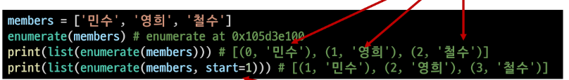

# Python 제어문

1. 코드 스타일 가이드
   
   - 코드를 '어떻게 작성할지'에 대한 가이드라인
   
   - 파이썬에서 제안하는 스타일 가이드 :  PEP8
   
   - 각 회사, 프로젝트 마다 정하는 스타일 가이드도 있음
   
   - 들여쓰기 
     
     - 문장 구분할 때, 들여쓰기(indentation)를 사용
     
     - 들여쓰기 할때 4칸(space키 4번) 혹은 1탭(Tab키 1번)을 입력,<mark> 한코드안에서 한종류의 들여쓰기 사용!!!</mark>

2. 조건문
   
   - 참/거짓을 판단할 수 있는 조건식과 함께 사용
   
   - 조건에는 참/ 거짓에 대한 조건식
     
     - 조건이 참인 경우 이후 들여쓰기 되어있는 코드 블록 실행
     
     - 이외의 경우  else 이후 들여쓰기 되어있는 코드 블록 실행
   
   - 실습문제 #조건문을 통해 num의 값의 홀수 / 짝수 여부를 출력
     
     ```python
     num = int(input('숫자 입력: '))
     if num % 2: # if num % 2 == 1:
        print('홀수')
     else:
        print('짝수')
     ```
   
   - 복수 조건문
     
     - 복수의 조건식을 활용할 경우 elif를 활용하여 표현함
   
   - 중첩 조건문
     
     - 조건문은 다른 조건문에 중첩되어 사용가능, 들여쓰기 유의해 작성할 것
   
   - 조건 표현식
     
     - 조건 표현식을 일반적으로 조건에 따라 값을 정할 때 활용
     
     - 삼항 연사자(Ternary Operator)로 부르기도 함
     
     - <mark>true인 경우 값 if  조건 else false인 경우 값</mark>

3. 반복문
   
   특정 조건을 만족할 때까지 같은 동작을 계속 반복하고 싶을 때 사용
   
   - While문: 종료 조건에 해당하는 코드를 통해 반복문을 종료시켜야함
     
     - 조건이 참인 경우 들여쓰기 되어있는 코드 블록이 실행됨
     
     - 코드 블록이 모두 실행되고, 다시 조건식을 검사하며 반복적으로 실행
     
     - while문은 무한 루프를 하지 않도록 <mark>종료 조건</mark>이 반드시 필요
   
   - for문: 반복가능한 객체를 모두 순회하면종료(별도의 종료 조건이 필요 없음)
     
     - for 문은 시퀀스(string,tuple,list,range)를 포함한 순회 가능한 객체 (iterable)의 요소를 모두 순회
     
     - 처음부터 끝까지 모두 순회하므로 별도의 종료 조건이 필요하지 않음
     
     - for문을 이용한 문자열(string) 순회
       
        #1 
       
       #2 
     
     - 딕셔너리(Dictionary) 순회
       
       - 딕셔너리는 기본적으로 key를 순회하며 ,key를 통해서 값을 활용
         
         
       
       - 추가 메서드를 활용한 딕셔너리 순회
         
         - keys() : key로 구성된 결과
         
         - values(): value로 구성된 결과
         
         - items(): (Key,value)의 튜플로 구성된 결과
         
         
     
     - enumerate 순회
       
       - enumerate() :인덱스와 객체를 쌍으로 담은 열거형(enumerate) 객체 반환
       
       - (index,value) 형태의 tuple로 구성된 열거 객체를 반환
         
         
       
       
     
     - List comprehension
       
       - 표현식과 제어문을 통해 특정 값을 가진 리스트를 간결하게 생성하는 방법
       
       - <mark>[code for 변수 in iterable]</mark>
         
         
     
     - Dictionary comprehension
       
       - 표현식과 제어문을 통해 특정한 값을 가진 딕셔너리를 간결하게 생성하는 방법
       
       - <mark>{key:vaue for 변수 in iterable}</mark>
         
         
   
   - 반복문 제어 : break, continue, for-else,pass
     
     - break : 반복문을 종료
     
     - continue: continue 이후의 코드 블록은 수행하지 않고 다음 반복을 수행
     
     - for-else: 끝까지 반복문을 실행한 이후에 else 문 실행
     
     - pass: 아무것도 하지않음(문법적으로 필요하지만, 할 일이 없을 때 사용)


