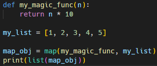
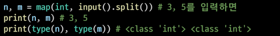

# Python 함수2

1. 함수 응용
   
   - 내장 함수(Built-in Functions)
     
     - 파이썬 인터프리터에는 항상 사용할 수 있는 많은 함수와 형(type)이 내장되어 있음
     
     - map
       
       - map(function,iterable)
         
         
       
       - 알고리즘 문제 풀이시 input 값들을 숫자로 바로 활용하고 싶을 때 많이 사용됨
         
         
     
     - filter
       
       - filter(function, iterable)
       
       - 순회 가능한 데이터구조(iterable)의 모든 요소에 함수 적용하고, 그 결과가 True인것들을  filter object로 반환
     
     - zip
       
       - zip(*iterable<mark>s</mark>)
       
       - 복수의 iterable을 모아 튜플을 원소로 하는 zip object로 반환
     
     -  lambda 함수
       
       - `lambda[parameter]: 표현식`
       
       -  표현식을 계싼한 결괏값을 반환하는 함수로, 이름이 없는 함수여서 익명 함수라고 불림
       
       - ```python
         ```python
         map(lambda x : x * 10, [1, 2, 3])
         
         
         ```
       
       
     
     - 재귀함수(recursive function)
       
       - 자기 자신을 호출하는 함수
       
       - ```python
         # 재귀함수를 이용한 팩토리얼 함수
         # n! = n * (n-1)!
         def fac(n):
             if n == 0:
                 return 1 #반복을 끝내기 위해 return 0!=1
             return n * fac(n - 1)
         
         print(fac(5))
         ```
     
         

2. 함수 가변 입력 (패킹/언패킹)
   
   - 모든 시퀀스형(리스트,튜플 등)은 패킹/언패킹 연산자 *를 사용하여 객체의 패킹 또는 언패킹이 가능
   
   - 패킹의 경우 , 리스트로 대입
   
   - 언패킹의 경우 튜플 형태로 대입
   
   - 가변인자 (*args)
     
     - 여러개의 positional argument를 하나의 필수 parameter로 받아서 사용
     
     - 몇개의 positianl argument를 받을지 모르는 함수를 정의할 때 유용
   
   - 가변 키워드 인자 (**kwargs)
     
     -  몇개의 키워드 인자를 받을지 모르는 함수를 정의할 떄 유용
     
     - **kwargs는 딕셔너리로 묶여 처리됨
   
   - 가변인자(*args)와 가변 키워드 인자 (**kwargs) 동시 사용 예시
     
     - (*args,**kwargs)

3. 모듈과 패키지
   
   - 모듈,module : 다양한 기능을 하나의 파일(.py)로
     
     - 특정 기능을 하는 코드를 파이썬 파일(.py) 단위로 작성한 것
     
     - ```python
       import module
       from module import var, function, Class
       from module import *
       ```
   
   - 패키지,package: 다양한 파일(.py)을 하나의 폴더로
     
     - 여러 모듈의 집합
     
     - ```python
       from package import module
       from pachkage.module import var, function,class
       ```
   
   - 라이브러리,library: 다양한 패키지를 하나의 묶음으로
   
   - pip: 이것들을 관리하는 관리자
     
     - PyPI(python package index)에 저장된 외부 패키지들을 설치하도록 도와주는 패키지 관리 시스템
     
     - 파이썬 패키지 관리자(pip) 명령어
       
       - 패키지 설치 
         
         - 최신 버전/ 특정 버전/ 최소 버전을 명시하여 설치할 수 있음
           
           - pip install SomePackage
           
           - pip install SomePackage == 1.0.5
       
       - 패키지 삭제: pup uninstall SomePackage
       
       - 패키지 관리
         
         - pip freeze > requirements.txt
         
         - pip install -r requirements.txt
   
   - 모듈과 패키지 활용
     
     - 패키지는 여러 모듈/하위 패키지로 구조화
       
       - 활용 예시: package.module
     
     - 모든 폴더에는 `__init__.py` 를 만들어 패키지로 인식
     
     - `from import` 활용 하여 가져옴

4. 가상환경
   
   - 복수의 프로젝트를 하는 경우 버전이 상이할 수 있음
   
   - 이런 경우 가상환경을 만들어 프로젝트별로 독립적인 패키지를 관리 할 수 있다.
   
   - 가상 환경을 만들고 관리하는데 사용되는 모듈(Python 버전 3.5부터)
   
   - 특정 디렉토리에 가상 환경을 만들고, 고유한 파이썬 패키지 집합을 가질 수 있음
   
   - `python -m venv < 폴더명=venv> `, 
   
   - `source <폴더명=venv>/Scripts/activate`:활성화
   
   - `deactivate`":비활성화
     
     


