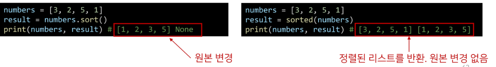

# python 데이터 구조(Data structure)

1. 데이터 구조(Data Structure)
   
   - 여러 데이터를 효과적으로 사용, 관리하기 위한 구조
   
   - 파이썬에는 대표적으로 List, Tuple, Dict, Sect등의 데이터 구조가 있음

2.  데이터 구조 활용
   
   - 데이터 구조를 활용하기 위해서 메서드(method)를 사용
   
   - 메서드는 클래스 내부에 정의한 함수, 사실상 함수 동일
   
   - <mark>데이터 구조. 메서드() 형태로 활용</mark>
   
   - 매서드는 다 외우는것이 아닌 <mark>공식문서</mark> 찾아보기

3.  순서가 있는 데이터 구조
   
   - 문자열(String type) 
     
     - 모든 문자는 str 타입<mark>(변경 불가능함 immutable)</mark>
     
     - immutable인데 문자열 변경이되는 이유?? - 기존의 문자열을 변경하는 것이 아니라, <mark>변경된 문자열을 새롭게 만들어서 반환하는 것</mark>
     
     - 문자열의 매서드도 immutable한 문자열의 성질을 따름
   
   - 리스트(list)
     
     - 리스트는 여러 개의 값을 순서가 있는 구조로 저장할 때 사용
     
     - `[]`또는  `list()`를 통해 생성
     
     - <mark>가변 자료형 (mutable</mark>)
     
     - 순서가 있는 시퀀스로 인덱스를 통해 접근 가능
     
     - 
     
     - .sort(), 와 sorted함수 비교
   
   - 튜플(Tuple)
     
     - list와 비슷하지만 변경 불가능함
     
     - 보통 파이썬 내장함수들 튜플로 해놓음, 변경불가하기 위해
   
   - 
