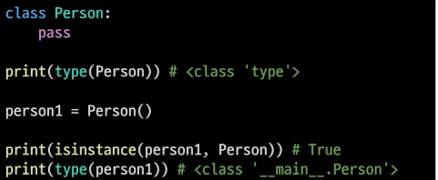
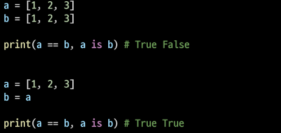

# Python 객체 지향 프로그래밍 1

1. 객체 지향 프로그래밍이란?(Object- Oriented Programming, OOP)
   
   - 컴퓨터 프로그래밍의 패러다임 중 하나
   
   - 컴퓨터 프로그램을 <mark>명령어의 목록으로 보는 시각에서 벗어나</mark> <mark>여러 개의 독립된 단위</mark>, 즉 "객체"들의 모임으로 파악하고자 하는 것
   
   - 각각의 객체는 메시지를 주고받고, 데이터를 처리할 수 있다.
   
   - 객체 지향의 장점
     
     - 객체 잘 만들면 재사용이 가능
     
     - 객체는 그 자체로 데이터와 행동이 정의됨(독립적) == 개발자가 내부 구조를 몰라도 그냥 가져다가 다른 객체와 조립하면서 개발 가능
     
     - 객체 단위로 모듈화시켜 개발할 수 있으므로 많은 인원이 참여하는 대규모 소프트웨어 개발 가능
     
     - <mark>개발 용이성, 유지 보수 편의성, 신뢰성을 바탕으로 생산성 대폭 증가</mark>
   
   - 객체 지향의 단점
     
     - 설계시 많은 노력과 시간 필요
       
       - 다양한 객체들의 상호 작용 구조를 만들기 위해 많은 시간과 노력 필요
     
     - 실행 속도가 절차 지향 프로그래밍보다 느림

2. OOP 기초
   
   - 객체와 인스턴스
     
     -  클래스로 만든 객체를 인스턴스라고 함   
   
   - 파이썬은 모든 것이 객체 , 파이썬의 모든 것에 속성과 행동이 존재

3. OOP 문법
   
   - 클래스와 인스턴스
     
     - 클래스: 객체들의 분류/ 설계도
     
     - 인스턴스: 하나하나의 실체
     
     - 
   
   - 객체 비교
     
     - `==`: 동등함(equal), 내용이 동등한 경우 True 하지만 같은 대상을 가리키고 있는 것은 아님
     
     - `is`: 동일한(identical), 두 변수가 동일한 객체를 가리키는 경우 True
     
     - 
   
   - 인스턴스 변수
     
     - 인스턴스가 개인적으로 가지고 있는 속성(attribute)
     
     - 생성자 메서드(`__init__`)에서 self.`<name>`으로 정의
     
     - 인스턴스가 생성된 이후 `<instance>.<name>`을 접근 및 할당
   
   - 클래스 변수
     
     - 한 클래스의 모든 인스턴스가 공유하는 값을 의미
     
     - 같은 클래스의 인스턴스들은 같은 값을 갖게 됨
     
     - `<classname>.<name>`으로 접근 및 할당 가능
   
   - OOP 메서드 
     
     - 메서드: 특정 데이터 타입/클래스의 객체에 공통적으로 적용 가능한 행위(함수)
     
     - OOP 메서드 종류: 인스턴스 메서드, 클래스 메서드, 정적 메서드
       
       - 인스턴스 메서드
         
         - 인스턴스 변수를 사용하거나, 인스턴스 변수에 값을 설정하는 메서드
         
         - 클래스 내부에 정의되는 메서드의 기본
         
         - 호출 시 , 첫번째 인자로 인스턴스 자기자신(<mark>self</mark>)이 자동으로 전달
         
         - 매직 메서드
           
           - 특별한 인스턴스 메서드
           
           - (`__`)가 있는 메서드는 특수한 동작을 위해 만들어진 메서드로 스페셜 메서드, 매직 메서드라고 불림
           
           - ex) `__str__(self)`, `__len__(self)` 등
         
         - 생성자 메서드
           
           - 인스턴스 객체가 생성될 때 자동으로 호출되는  메서드
           
           - 인스턴스 변수들의 초기값 설정
           
           - `__init__`
       
       -  클래스 메서드
         
         - 클래스가 사용할 메서드
         
         - `@classmethod` 데코레이터를 사용하여 정의
         
         - 호출시, 첫번째 인자로 클래스(cls)가 전달
         
         - 데코레이터: 함수를 어떤 함수로 꾸며서 새로운 기능을 부여
           
           - `@데코레이터(함수명)` 형태로 함수 위에 작성
           
           - 순서대로 적용 되기 때문에 작성 순서가 중요
       
       - 스태틱 메서드
         
         - 인스턴트 변수, 클래스 변수를 전혀 다루지 않는 메서드
         
         - 속성을 다루지 않고 단지 기능만을 하는 메서드를 정의할 때, 사용
         
         - `@staticmethod` 데코레이터를 사용하여 정의

