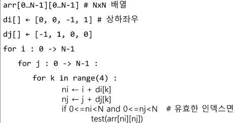
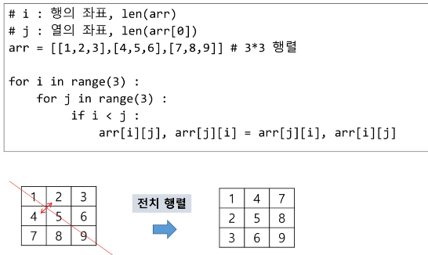
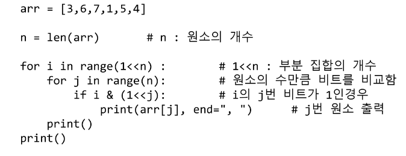

# Algorithm 배열2(Array2)

1. 배열: 2차원 배열
   
   - 1차원  List를 묶어놓은 List
   
   - 2차원 이상의 다차원 List는 차원에 따라 Index를 선언
   
   - 2차원 List의 선언: 세로길이(행의 개수), 가로길이(열의 개수)를 필요로 함
   
   - Python 에서는 데이터 초기화를 통해 변수선언과 초기화가 가능함
   
   - 배열 순회
     
     - 행 우선 순회    
     
     - ```python
       # i 행의 좌표
       # j 열의 좌표
       for i in range(n):
           for j in range(m):
               Array[i][j] #필요한 연산
       ```
     
     - 열 우선 순회
       
       - ```python
         # i행의 좌표
         #j 열의 좌표
         for j in range(n):
             for i in range(m):
                 Array[i][j] #필요한 연산
         ```
     
     - 지그재그 순회
       
       - ```python
         # i행의 좌표
         #j 열의 좌표
         for i in range(n):
             for j in range(m):
                 Array[i][j+ m-1-2*j) * (i%2)] #(i%2) 짝수일때는 0
         ```
     
     - 델타를 이용한 2차 배열 탐색
       
       - .
     
     - 전치 행렬
       
       - 

2. 부분집합 생성
   
   - 부분집합의 수
     
     - 집합의 원소가  n개일 떄, 공집합을 포함한 부분집합의 수는 `2**n`개이다.
     
     - 이는 각 원소를 부분집합에 포함시키거나 포함시키지 않는 2가지 경우를 모든 원소에 적용한 경우의 수와 같다.
   
   - 각 원소가 부분집합에 포함되었는지를 loop 이용해 확인하고 부분집합을 생성하는 방법
     
     - ```python
       bit = [0, 0, 0, 0]
       for i in range(2):
           bit[0] = i           # 0번째 원소
           for j in range(2):
               bit[1] = j        # 1번째 원소
               for k in range(2):
                   bit[2] = k    # 2번째 원소
                   f l in range(2):
                       bit[3] = 1 # 3번째 원소
                       print_subset(bit)  # 생성된 부분집합 출력 
       ```
   
   - 비트 연산자
     
     - `&` 비트 단위로 AND 연산을 함
     
     - `|` 비트 단위로  OR 연산을 함
     
     - `<<` 피연산자의 비트 열을 왼쪽으로 이동시킨다.
     
     - `>>` 피연산자의 비트 열을 오른쪽으로 이동시킨다.
   
   - `<<`연산자
     
     - 1 << n : 2**n 즉, 원소가 n개일 경우의 모든 부분집합의 수를 의미한다.
   
   - `&` 연산자
     
     - i & (1<<j): i의 j번째 비트가 1인지 아닌지를 검사한다.
   
   - 비트 연산자를 이용해 간결하게 부분집합을 생성하는 방법
     
     - 
