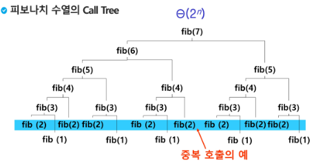

# Algorithm Stack2

1.  재귀호출
   
   - 자기자신을 호출하여 순환 수행되는 것
   
   - 함수에서 실행해야하는 작업의 특성에 따라 일반적인 호출방식보다 재귀호출방식을 사용하여 함수를 만들면 프로그램의 크기를 줄이고 간단하게 작성
   
   - 재귀 호출의 예) factorial, 피보나치
   
   - ```python
     def fibo(n):
     
         if n < 2:
             return n
         else:
             return fibo(n-1) + fibo(n-2)
     ```

2. Memoization
   
   - 앞의 피보나치 수를 구하는 함수를 재귀함수로 구현한 알고리즘은 문제점
   
   - 중복 호출이 너무 많음
   
   - 
   
   - memization은 컴퓨터 프로그램을 실행할 때 이전에 계산한 값을 메모리에 저장해 매번 다시 계산하지 않도록 하여 전체적인 실행속도를 빠르게 하는 기술
   
   - ```python
     def fibo1(n):
         global memo
         if n>= 2 and memo[n] ==0:
             memo[n] = (fibo1(n-1) + fibo1(n-2))
         return memo[n]
     memo = [0] * (n+1)
     memo[0] = 0
     memo[1] = 1
     ```

3. DP(Dynamic Programming)
   
   - 동적 계획(Dynamic Programming) 알고리즘은 그리디 알고리즘과 같이 최적화 문제를 해결하는 알고리즘
   
   - 동적 계획 알고리즘은 먼저 입력 크기가 작은 부분 문제들을 모두 해결한 후에 그해들을 이용하여 보다 큰 크기의 부분 문제들을 해결하여, 최종적으로 원래 주어진 입력의 문제를 해결하는 알고리즘
   
   - 피보나치 DP 적용 
     
     - 피보나치 수는 부분 문제의 답으로부터 본 문제의 답을 얻을 수 있으므로 최적 부분 구조로 이루어져 있음
     
     - ```python
       def fobo2(n):
           f = [0] *(n+1)
           f[0] = 0
           f[1] = 1
           for i in range(2, n+1):
               f[i] = f[i-1] +f[i-2]
           return f[n]
       ```

4.  DFS(깊이우선탐색)
   
   - 비선형구조인 그래프 구조는 그래프로 표현된 모든 자료를 빠짐없이 검색하는 것이 중요
   
   - 두가지 방법
     
     - 깊이 우선 탐색(Depth First Search, DFS)
     
     - 너비 우선 탐색(Breadth First Search, BFS)
   
   - 시작 정점의 한 방향으로 갈 수있는 경로가 있는 곳까지 깊이 탐색해 가다가 더 이상 갈 곳이 없게 되면, 가장 마지막에 만났던 갈림길 간선이 있는 정점으로 되돌아와서 다른 방향의 정점으로 탐색을 계속 반복하여 결국 모든 정점을 방문하는 순회방법
   
   - 가장 마지막에 만났던 갈림길의 정점으로 되돌아가서 다시 깊이 우선 탐색을 반복해야 하므로 후입선출 구조의 스택 사용


