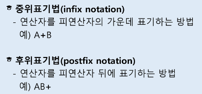

# Algorithm Stack3

1.  계산기 1
   
   - 문자열로 된 계산식이 주어질 때, 스택을 이용하여 이 계산식의 값을 계산할 수 있다.
   
   - 문자열 수식 계산의 일반적 방법
     
     - step1 중위 표기법의 수식을 후위 표기법으로 변경한다. (스택 이용)
     
     - step2 후위 표기법의 수식을 스택을 이용하여 계산한다.
       
       

2.  백트래킹
   
   - 백트래킹 기법은 해를 찾는 도중에 '막히면'(즉 해가 아니면) 되돌아가서 다시 해를 찾아 가는 기법
   
   - 백트래킹 기법은 최적화 문제와 결정 문제를 해결할 수 있음
   
   - 결정 문제: 문제의 조건을 만족하는 해가 존재하는지의 여부를 'yes' 또는  'no' 가 답하는 문제
     
     - 미로 찾기
     
     - n-Queen 문제
     
     - Map coloring
     
     - 부분 집합의 합(subset sum) 문제 등

