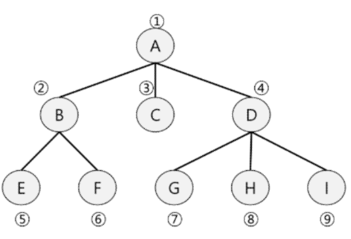
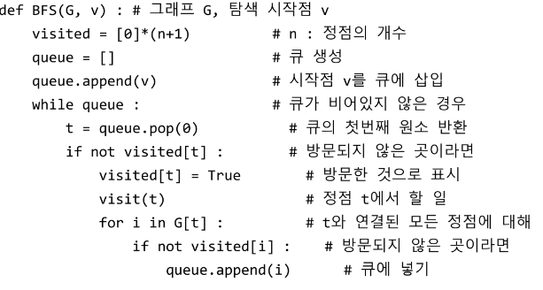
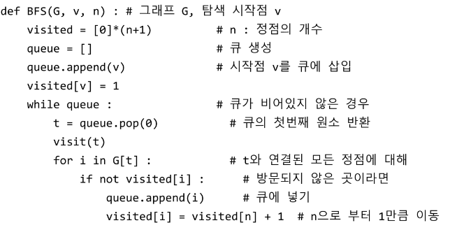

# Algorithm Queue2

1.  큐의 활용: 버퍼(Buffer)
   
   - 버퍼
     
     - 데이터를 한 곳에서 다른 한 곳으로 전송하는 동안 일시적으로 그 데이터를 보관하는 메모리의 영역
     
     - 버퍼링: 버퍼를 활용하는 방식 또는 버퍼를 채우는 동작을 의미한다.
   
   - 버퍼의 자료 구조
     
     - 버퍼는 일반적으로 입출력 및 네트워크와 관련된 기능에서 이용된다.
     
     - 순서대로 입력/출력/전달되어야 하므로 FIFO 방식의 자료구조인 큐가 활용됨

2.  BFS(Breadth First Search)
   
   - 그래프를 탐색하는 방법 크게 두가지
     
     - 깊이 우선 탐색(Depth First Search, DFS)
     
     - 너비 우선 탐색(Breadth First Search, BFS)
   
   - 너비우선탐색은 탐색 시작점의 인접한 정점들을 먼저 모두 차례로 방문 후, 방문했던  정점을 시작점으로 하여 다시 인접한 정점들을 차례로 방문하는 방식
   
   - 인접한 정점들에 대해 탐색을 한 후, 차례로 다시 너비우선탐색을 진행해야 하므로, 선입선출 형태의 자료구조인 큐를 활용
   
   - 
   
   - 
   
   - 
   
   

