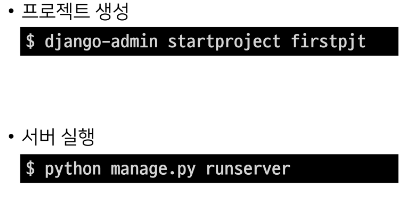
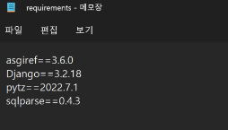

# Django_230314

## Django 시작하기

- 웹 서비스 개발에는 많은 것들이 필요하다
  
  - 로그인, 로그아웃, 회원관리, 데이터베이스, 서버, 클라이언트 등
  
  - 모든 걸 직접 만들 필요가 없다.

- Framework 이해하기
  
  - 누군가 만든 코드를 재사용하는 건 익숙한 개발 문화
  
  - Framework란 서비스 개발에 필요한 기능들을 미리 구현해 모아 놓은 것
  
  - Framework를 잘 사용하면 웹 서비스 개발에 있어 모든 것을 만들 필요 없이 만들고자하는 비지니스 로직에 집중해 개발할 수 있음

## Django 시작

- 설치및 실행
  
  - 
  
  - 

## 가상환경

- 가상환경은 프로젝트별 패키지를 독립적으로 관리하기 위한 것

- 가상환경 사용하기
  
  - 가상환경 생성
    
    - python -m venv venv
  
  - 가상환경 활성화(ON)
    
    - source venv/Scripts/activate
  
  - 가상환경 비활성화(OFF)
    
    - deactivate
  
  - 가상환경 패키지 목록 저장
    
    - pip freeze > requrements.txt
  
  - 파일로부터 패키지 설치
    
    - pip install -r requrements.txt
    
    - 

# 
