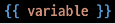

# Django_230315

## Django's Design Pattern

- Django에 적용된 디자인 패턴은 MTV 패턴(Model-Template-View)
  
  - Model 
    
    - 데이터와 관련된 로직을 관리
    
    - 응용프로그램의 데이터 구조를 정의하고 데이터베이스의 기록을 관리
  
  - Template
    
    - 레이아웃과 화면을 처리
    
    - 화면상의 사용자 인터페이스 구조와 레이아웃을 정의
  
  - View
    
    - Model & Template과 관련한 로직을 처리해서 응답 반환
    
    - 클라이언트의 요청에 대해 처리를 분기하는 역할

## Django Template

- 데이터 표현을 제어하는 도구이자 표현에 관련된 로직

- Django Template을 이용한 HTML 정적 부분과 동적 컨텐츠 삽입

- Django Template System
  
  - 데이터 표현을 제어하는 도구이자 표현에 관련된 로직을 담당

- Django Template Language(DTL)
  
  - 조건,반복, 변수 치환, 필터 등의 기능을 제공
    
    - Python처럼 일부 프로그래밍 구조(if, for 등)를 사용할 수 있지만 이것은 python 코드로 실행되는 것이 아님
    
    - Django 템플릿 시스템은 단순히 Python이 HTML에 포함 되는 것은 아니니 주의
  
  - 프로그래밍적 로직이 아니라 프레젠테이션을 표현하기 위한 것임을 명심
  
  - DTL Syntax
    
    - Variable
      
      
      
      - render()의 세번쨰 인자로 {'key':value}와 같이 딕셔너리 형태로 넘겨줌, 여기서 정의한 key에 해당하는 문자열이 template에서 사용 가능한 변수명이 됨
    
    - Filters
      
      
      
      - 표시할 변수를 수정할 때 사용
      
      - chained가 가능하며 일부 필터는 인자를 받기도 함
    
    - Tags
      
      
      
      - 출력 텍스트를 만들거나, 반복 또는 논리를 수행하여 제어 흐름을 만드는 등 변수보다 복잡한 일들을 수행
      
      - 일부 태그는 시작과 종료 태그가 필요 
        
        
    
    - comments
      
      
      
      - Django template에서 라인의 주석을 표현하기 위해 사용
      
      - 한줄 주석에 사용
        
        
      
      - 여러줄 주석

## Template inheritance

- 템플릿 상속
  
  - 템플릿 상속은 기본적으로 코드의 재사용성에 초점을 맞춤
  
  - 템플릿 상속을 사용하면 사이트의 모든 공통 요소를 포함하고 하위 템플릿이 재정의 할 수 있는 블록을 정의하는 기본 'skeleton'의 템플릿을 만들 수 있음

- 템플릿 상속에 관련된 태그
  
  
  
  - 자식템플릿이 부모 템플릿을 확장한다는 것을 알림
  
  - 반듯이 템플릿 최상단에 작성 (2개이상 사용x)
  
  
  
  - 하위 템플릿에서 재지정할 수 있는 블록을 정의
  
  - 하위 템플릿이 채울수 있는 공간

