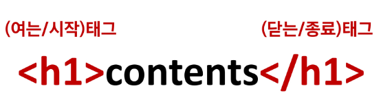
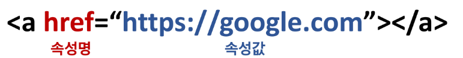
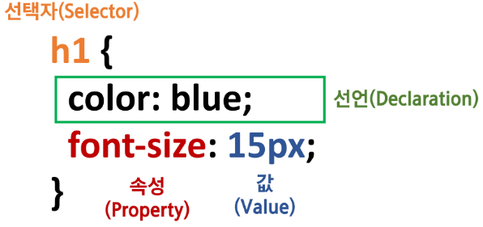

# Web

1.  웹사이트
   
   - 웹 브라우저를 통해서 접속하는 웹 페이지들의 모음
   
   - 링크를 통해 여러 웹 페이지를 연결한 것

2.  HTML
   
   - 웹 페이지를 구조화하기 위한 언어
   
   - 기본구조
     
     - html: 문서의 최상위(root) 요소
     
     - head: 문서 메타데이터 요소
       
       - 문서 제목, 인코딩, 스타일, 외부 파일 로딩 등
       
       - 일반적으로 브라우조에 나타나지 않는 내용
     
     - body: 문서 본문 요소
       
       - 실제 화면 구성과 관련된 내용
   
   - 요소(element)
     
     
     
     - HTML의 요소는 시작 태그와 종료 태그 그리고 태그 사이 위치한 내용으로 구성
       
       - 태그는 컨텐츠를 감싸는 것으로 그 정보의 성격과 의미를 정의
     
     - 요소는 중첩될 수 있음
       
       - 요소의 중첩을 통해 하나의 문서를 구조화
       
       - 여는 태그와 닫는 태그의 쌍을 잘 확인해야함
         
         - 오류를 반환하는 것이 아닌 레이아웃이 깨진 상태로 출력되어 디버깅이 힘듬
   
   - 속성(attribute)
     
     
     
     - 속성을 통해 태그의 부가적인 정보를 설정할 수 있음
     
     - 요소는 속성을 가질 수 있으며, 경로나 크기와 같은 추가적인 정보를 제공
     
     - 요소의 시작 태그에 작성하며 보통 이름과 값이 하나의 쌍으로 존재
     
     - 태그와 상관없이 사용 가능한 속성(HTML Global attrubute)들도 있음

3.  CSS
   
   
   
   - 스타일을 지정하기 위한 언어
   
   - CSS 구문은 선택자를 통해 스타일을 지정할 HTML 요소를 선택
   
   - 중괄호 안에서는 속성과 값, 하나의 쌍으로 이루어진 선언을 진행
   
   - 각 쌍은 선택한 요소의 속성, 속성에 부여할 값을 의미
     
     - 속성(Property): 어떤 스타일 기능을 변경할지 결정
     
     - 값(Value): 어떻게 스타일 기능을 변경할지 결정 
   
   - CSS 정의 방법
     
     - 인라인(inline)
     
     - 내부 참조(embedding) -<style>
     
     - 외부 참조(link file) - 분리된 CSS 파일
   
   - CSS 적용 우선순위
     
     - 중요도(importance) - 사용시 주의
       
       - !important
     
     - 우선순위(Specificity)
       
       - 인라인>id>class, 속성> 요소
