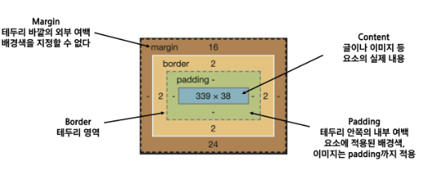

# Web_230308

## CSS BOX model

- 모든 요소는 네모(박스모델)이고, 위에서부터 아래로, 왼쪽에서 오른쪽으로 쌓임(NormalFlow)

- 하나의 박스는 네 부분(영역)으로 이루어짐
  
  
  
  - content
  
  - padding
  
  - border
  
  - margin

- box-sizing
  
  - 기본적으로 모든 요소의 box-sizing은 content-box
    
    - padding을 제외한 순수 contents 영역만을 box로 지정
  
  - 다만 일반적으로 영역을 볼 때 border까지 너비를 보는 경우
    
    - box-sizing을 border-box로 설정

## CSS Display

- display에 따라 크기와 배치가 달라짐

- block vs inline
  
  - display: block
    
    - 줄 바꿈이 일어나는 요소
    
    - 화면 크기 전체의 가로 폭을 차지
    
    - 블록 레벨 요소 안에 인라인 레벨 요소가 들어갈 수 있음.
    
    -  ex) div, p, form 등
  
  - display: inline
    
    - 줄 바꿈이 일어나지 않는 행의 일부 요소
    
    - content를 마크업 하고 있는 만큼만 가로 폭을 차지
    
    - width, height, margin-top, margin-bottom을 지정할 수 없다.
    
    - 상하 여백은 line-height로 지정
    
    - ex) span, a, input 등

- display: inline-block
  
  - block과 inline 레벨 요소의 특징을 모두 가짐
  
  - inline처럼 한 줄에 표시 가능하고 block처럼 width, height, margin 속성을 모두 지정할 수 있음

- display:none
  
  - 해당 요소를 화면에 표시하지 않고, 공간조차 부여되지 않음
  
  - 이와 비슷한 visibility: hidden은 해당 요소가 공간은 차지하나 화면에 표시만 하지 않는다.

## CSS position

- 문서 상에서 요소의 위치를 지정(어떤 기준으로 어디에 배치할지 정하기)

- static: 모든 태그의 기본 값(기본 위치)
  
  - 일반적인 요소의 배치 순서에 따름(좌측 상단)
  
  - 부모 요소 내에서 배치될 떄는 부모 요소의 위치를 기준으로 배치

- relative: 상대 위치
  
  - 자기 자신의 static 위치를 기준으로 이동(normal flow 유지)
  
  - 레이아웃에서 요소가 차지하는 공간은 static일 때와 같음

- absolute: 절대 위치
  
  - 요소를 일반적인 문서 흐름에서 제거 후 레이아웃에 공간을 차지하지 않음(normal flow에서 벗어남)
  
  - static이 아닌 가장 가까이 있는 부모/조상 요소를 기준으로 이동(없는 경우 body)

- fixed: 고정 위치
  
  - 요소를 일반적인 문서 흐름에서 제거 후 레이아웃에 공간을 차지하지 않음(normal flow에서 벗어남)
  
  - 부모 요소와 관계없이 viewport를 기준으로 이동
    
    - 스크롤 시에도 항상 같은 곳에 위치함

