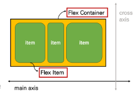

# Web_230309

## Float

- 박스를 왼쪽 혹은 오른쪽으로 이동시켜 텍스트를 포함 인라인요소들이 주변을 wrapping 하도록 함

- 요소가 Normal fow를 벗어나도록 함

- Float 속성
  
  - none: 기본값
  
  - left: 요소를 왼쪽으로 띄움
  
  - right: 요소를 오른쪽으로 띄움

- Float 최근에는 Flexbox, Grid 등과 함꼐 사용도가 낮아짐

## Flexbox

- Latout에 특화

- 

- 행과 열 형태로 아이템들을 배치하는 1차원 레이아웃 모델

- 축
  
  - main axis (메인 축)
  
  - cross axis(교차 축)

- 구성 요소
  
  - Flex Container(부모 요소)
    
    - flexbox 레이아웃을 형성하는 가장 기본적인 모델
    
    - Flex Item들이 놓여있는 영역
    
    - display 속성을 flex 혹은 inline-flex로 지정
  
  - Flex Item(자식 요소)
    
    - 컨테이너에 속해 있는 컨텐츠(박스)
